<!--yml
category: 未分类
date: 2023-04-18 22:41:48
-->

# 【业余毁三观】咱们人类还有个屁未来？用《资本论》分析《未来简史》到底靠不靠谱~马克思：尤瓦尔·赫拉利，你还太嫩！ - 玉虚龙宇君的小号 - BV1Bi4y1G76U

记得关注龙哥的今日头条号和新浪微博哟。

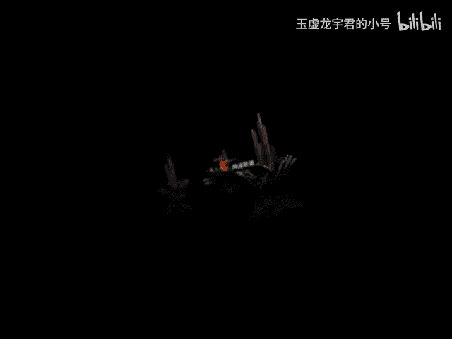

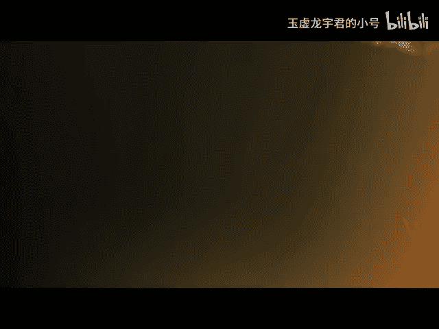

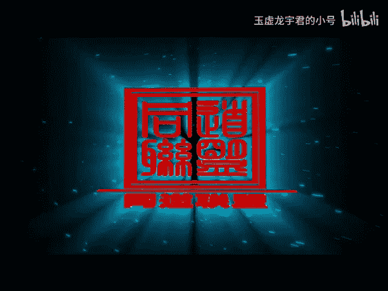

大家好，这是同道联盟，我是龙哥。

为了响应马克思诞成200周年，今天咱们就做一期关于资本论的主题。

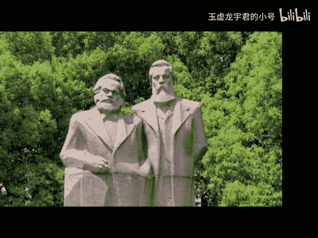

当然，不是单纯的解读资本论。

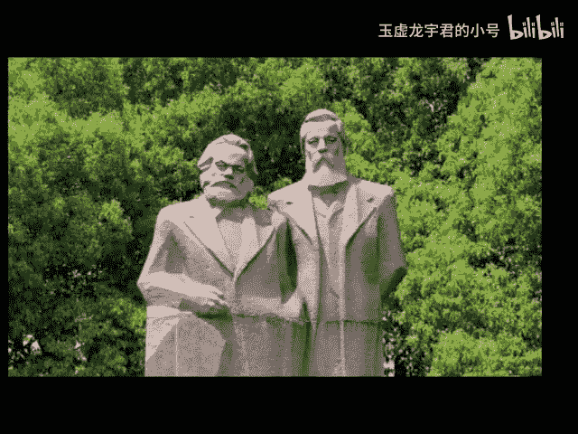

相信一大群经济学大咖已经把资本论分析的很透彻了。

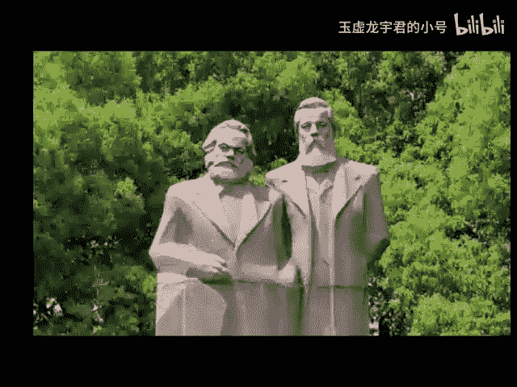

今天咱们另辟蹊径，打算用资本论分析另一部脑洞著作。

《未来简史》，它到底靠不靠谱。

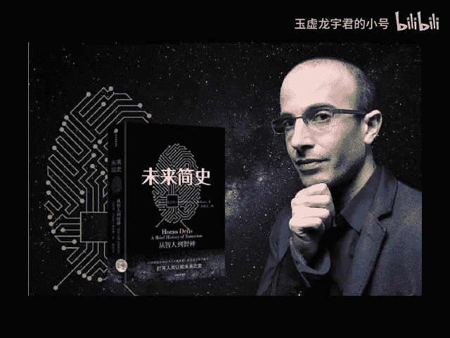

说起这《未来简史》，很多观众估计连听都没听过，那么，以下来做一个简介。

这《未来简史》是由以色列作家尤瓦尔·赫拉利创作的科学理论类著作。

该书主要讲述了进入21世纪后。

曾经长期威胁人类生存与发展的瘟疫、饥荒和战争已经基本被攻克。

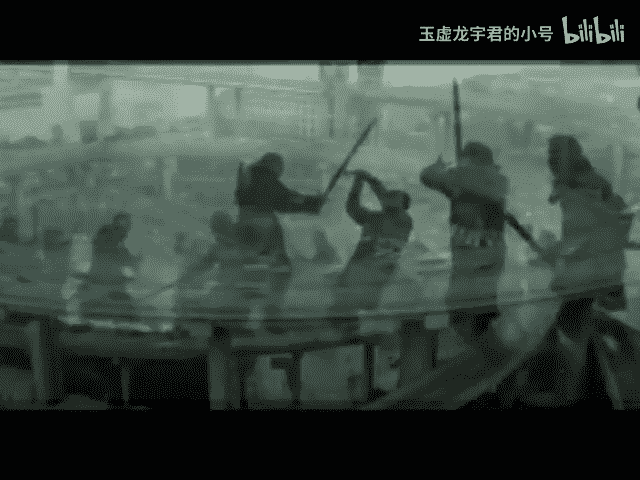

制人面临着全新的代办议题，永生不老、幸福快乐和成为具有神性的人类。

他指出，生物本身就是算法。

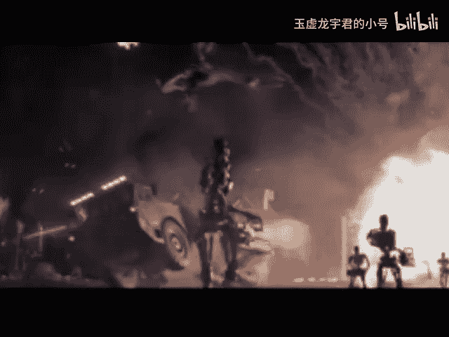

计算机和大数据将比我们自己更了解自己，未来，只有1%的人将完成下一次生物进化，升级为全新物种。

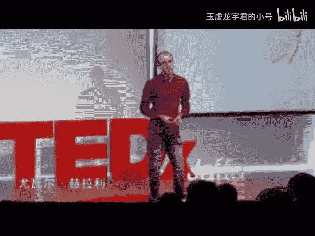

而剩下99%的人将彻底沦为无用阶级。

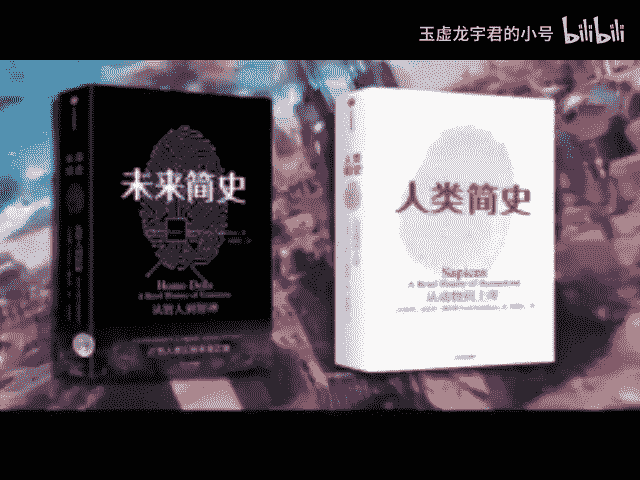

什么是无用阶级呢？，其实早在多年前，刘慈欣的小说《赡养人类》就比赫拉利更早提出了这个概念。

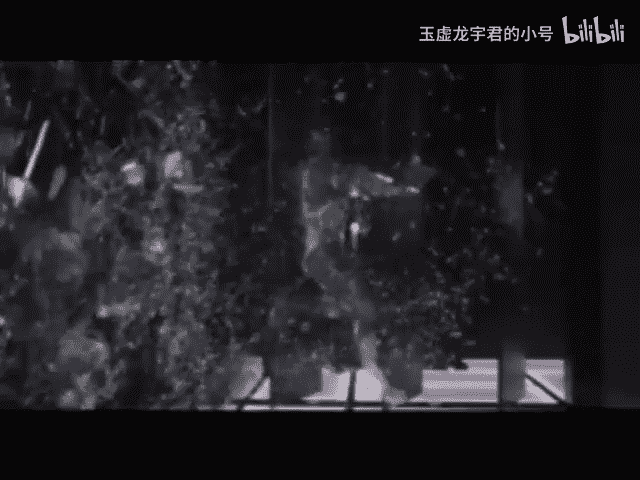

未来，资本主义达到顶峰。

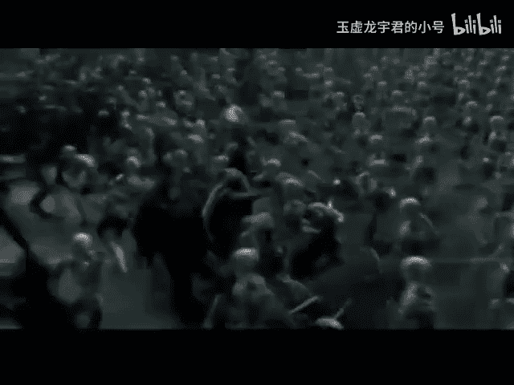

就像在19世纪工业革命创造出一个叫成事无产者的新阶级一样。

阶级斗争贯穿于整个19和20世纪的历史。

尤其是成事无产阶级，他们的愤怒和恐惧导致了一系列的革命。

在未来，她相信会出现一个庞大的新阶级，即无用阶级。

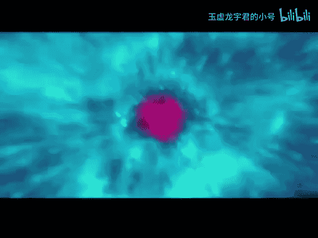

这个阶级的人既没有任何经济价值，也没有政治话语权。

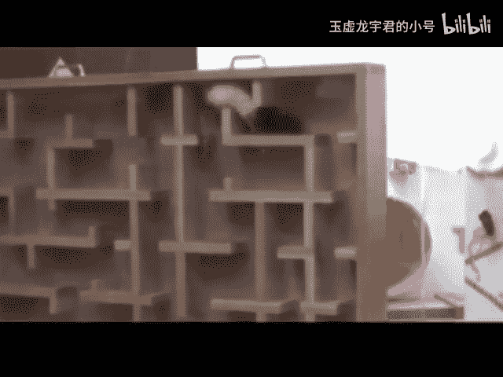

他们做任何事情都比不过计算机跟人工智能，比如出租车司机、卡车司机会被无人驾驶汽车所替代。

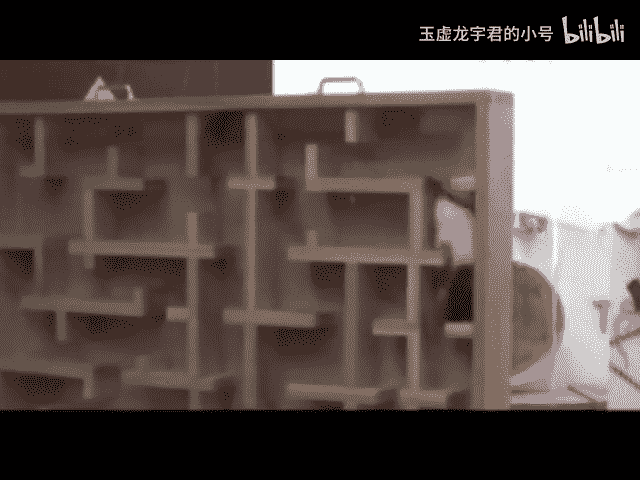

医生会被机器人医生所替代。

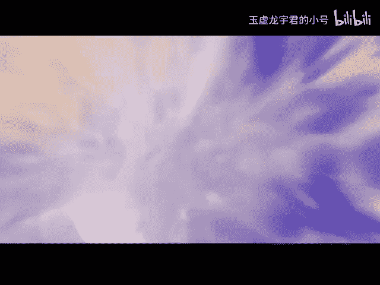

甚至连老师也会变成机器人。

社会资源将集中在少部分新人类手中，嗯？这听起来未来真的好灰暗啊。

人类还有个屁未来，但当我重新读了马克思的《资本论》后我发现。

未来简史重亚当斯密的读太深了。

把自由市场给吹爆了，但就算是基于自由市场经济。

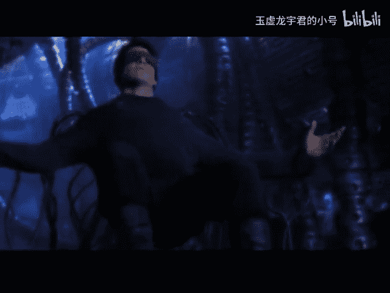

未来简史的逻辑也存在着内生性矛盾，大家知道物质商品生产出来的目的是分配和使用。

商人生产这些产品的最终目的是卖出去。

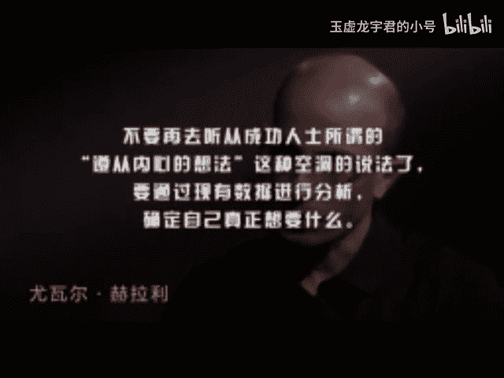

那么他通过人工智能跟计算机去生产这些的根本动机是为了降低成本。

然而咱们知道在上世纪30年代美国爆发的经济危机。

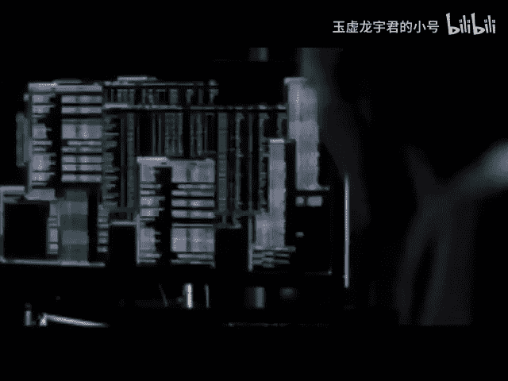

其根本原因就是社会生产过剩了。

没错 那个时候社会已经完成了手工到大机器生产线的转型。

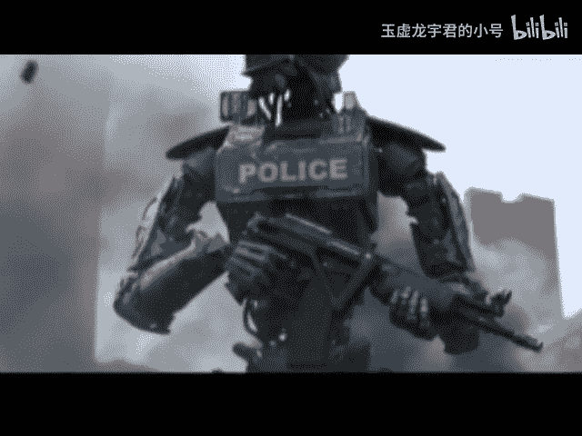

大量的产品都可以通过流水线被制造出来，但商品最终要流入市场进行交换和再分配。

造成产品过剩的根本原因就是供打于求。

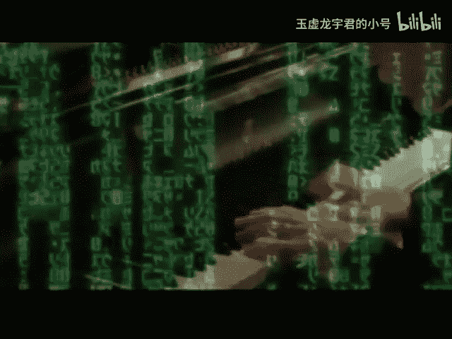

这供求关系是不平衡的，生产什么生产多少均由企业决定。

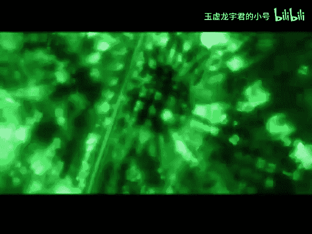

整个社会生产处于竞争和无政府状态，其结果因有支付能力的需求相对缩小而导致大量商品卖不出去。

它的恶性发展就是生产过剩危机，那咱们更夸张一点。

如果真如未来简史所说，人们做任何事情都比不过计算机跟人工智能。

导致社会出现一大批无用阶级，那么他们自然就没有收入来购买机器生产出来的产品了。

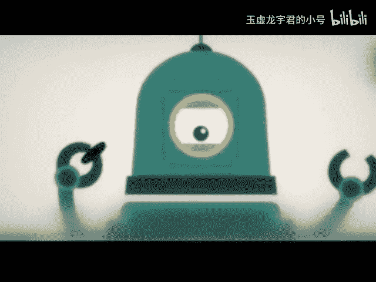

那就陷入一个悖论了。

资本家造这些东西干啥，造那么多东西卖不掉。

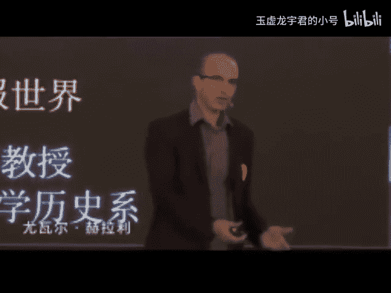

我造那么多东西干啥，用来服务少数精英阶层，但是精英的需求也是有限的哟。

随后连带着也不需要那么大规模的机器人生产线了。

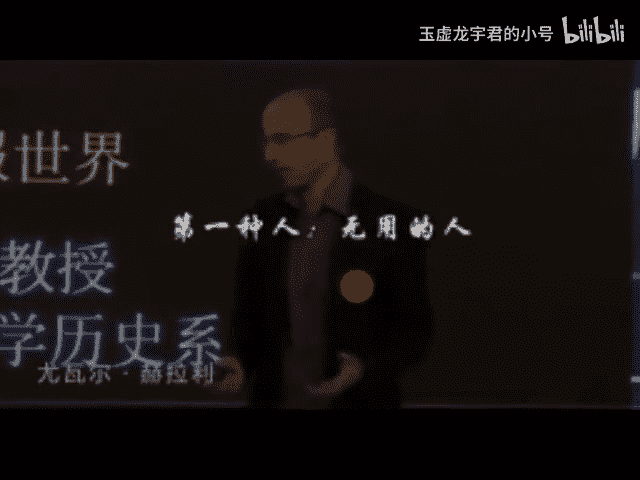

那么我生产那么多机器人就是为了干啥。

科技为何要发展，因为有需求，然而为了满足这个需求。

而投入的大量研发成本却是巨大的，如果需求不存在了，科技也将进入停滞。

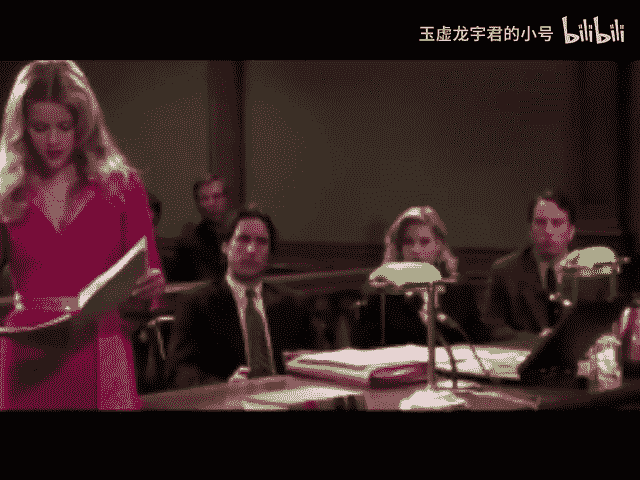

你想想古代几千年前到近代的科技进步速度是怎样的。

一切的科技进步也是基于需求，没这需求，发展这个干啥。

企业为降低生产成本在最大限度上获得利润。

他们为提高生产效率缩短自身的个别必要劳动时间，不可避免地导致了生产力的进步。

从而导致社会上的商品在数量上和种类上都得到了增加。

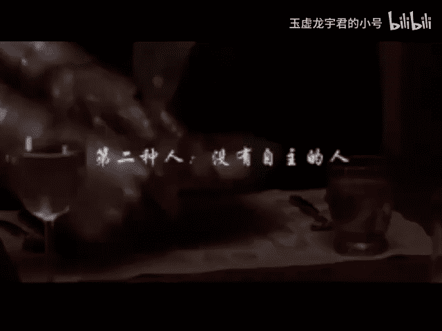

而由于社会贫富差距的悬殊。

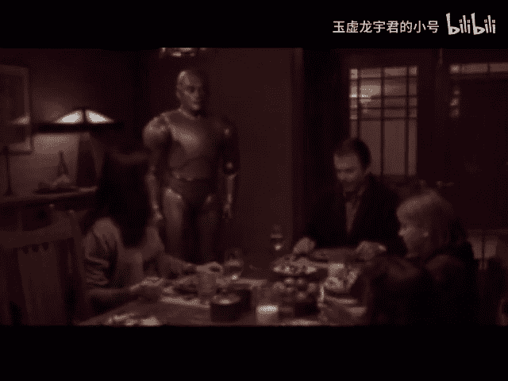

必然导致商品销售市场的相对缩小，换句话就是，我穷我买不起你生产那么多也是白费。

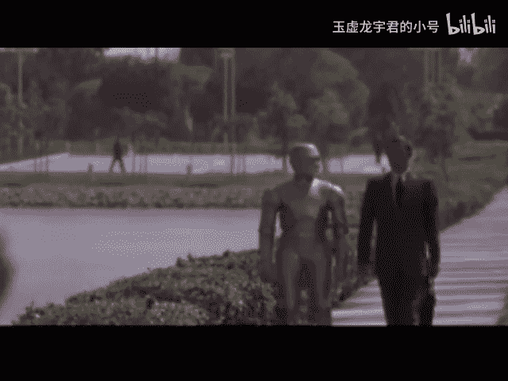

然后总感觉资本家就是在给自己挖坑啊。

那么这一套逻辑下来，资本家这个阶级也会跟着消失。

为何，因为市场已经变得无限小了，那时候还要钱干啥。

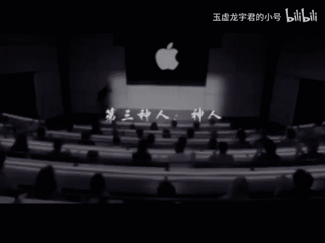

无用阶级已经压榨不出钱了，精英阶层的需求又是有限的。

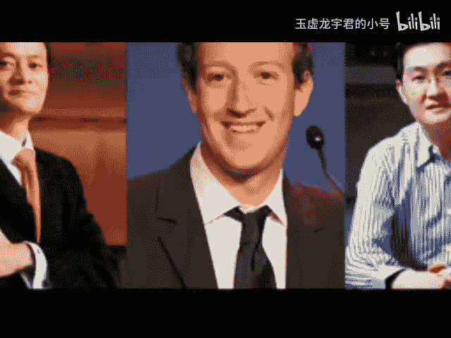

最终结果不就是货币也宣告消失吗。

因为货币存在的基石就是公求就是交换，未来简实所描写的未来。

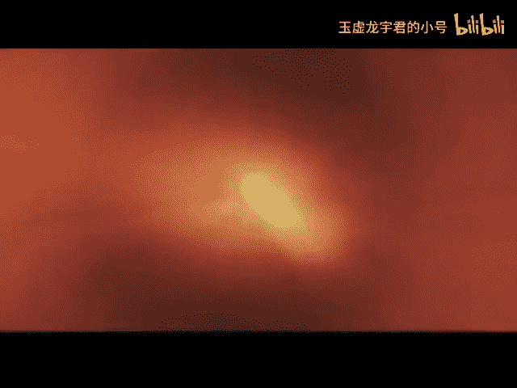

归根结底是建立在现有的交换体系内才得出的结果。

但如果把这逻辑再往远了推一推，可不就是代表交易跟货币本身也跟着终结了吗。

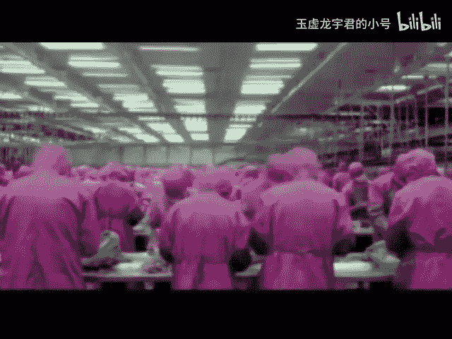

那这问题要咋解决呢，其实资本论早就告诉大家了。

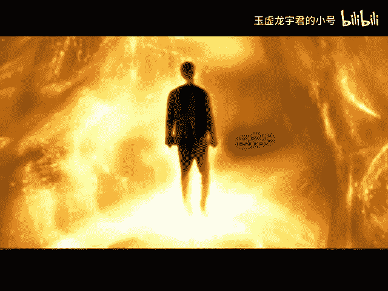

当年美国出现经济危机的时候，罗斯福就参考了资本论中的理论。

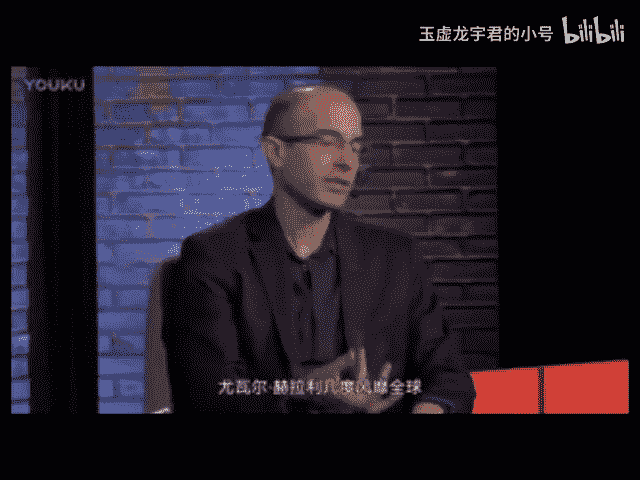

搞了罗斯福新政，具体内容其实跟我国国家的各种宏观调控大同小异。

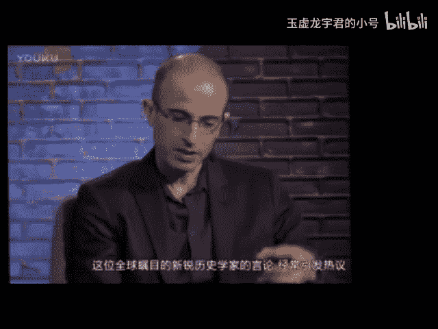

现在想想也是啊，每当西方资本主义国家出了问题。

才想起马克思主义理论来，然而等危机过去了。

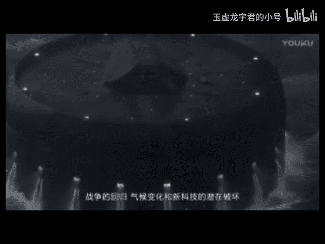

就好了伤疤忘了疼，又开始搞原来那套，然后周而复始陷入轮回。

不过现在想想，如果未来真的机器人代替了所有的人类劳动生产。

那么这时候已经具备了共产主义实现的基础了，为何。

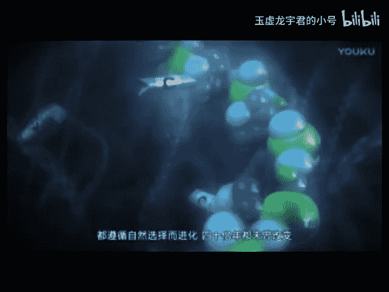

国家完全可以把这些机器人生产线收归国有吗，然后把产品变成社会福利。

安须分配，这不就是共产主义吗，或许可以用一个更难听点的名词。

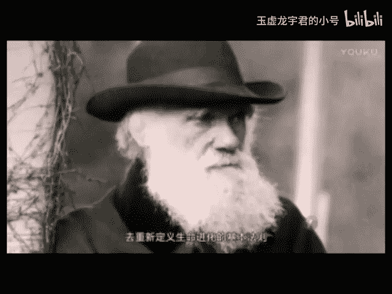

叫做养猪经济也可以啊。

资本家这个阶层的存在的基石就是资本，而资本的存在基石是公球。

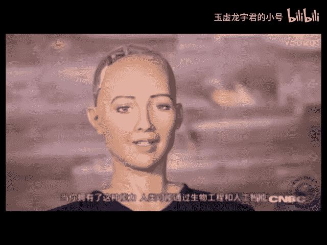

按照未来简史的逻辑，那些所谓的精英阶级会跟着无用阶级一块消失。

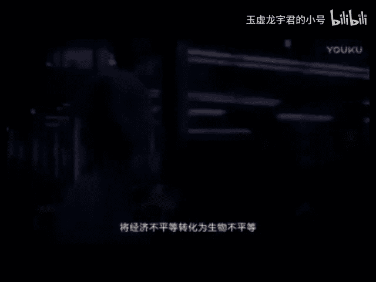

为何，生产和公球就是两个互相依存的密不可分的存在。

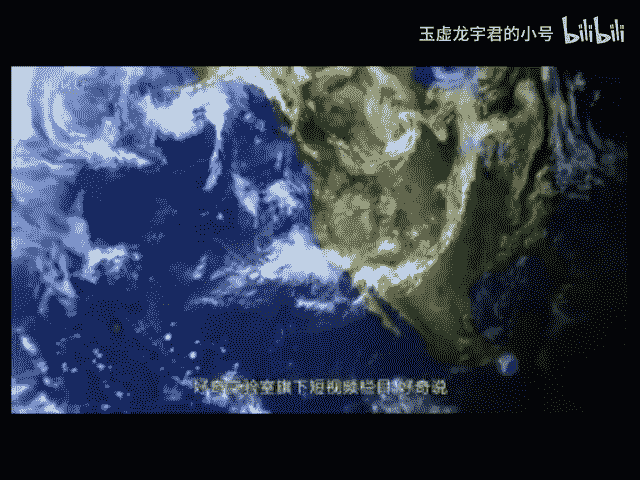

有句话叫无利不及早，如果生产的东西已经压榨不出利润了。

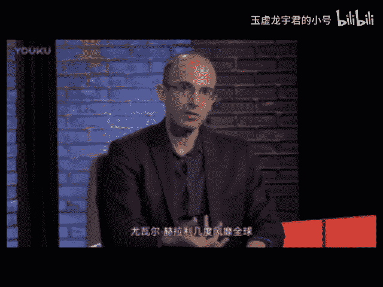

那生产本身就会停止，真到那时候才是天下何人不通共啊。

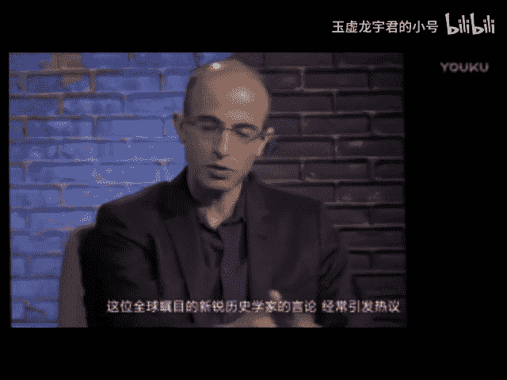

而且如果资本家知道了用人工智能会演变出这么一个结果。

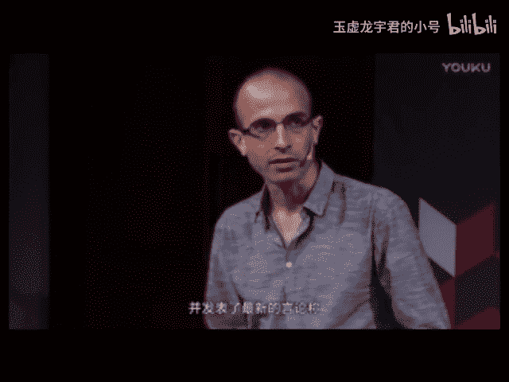

那资本家本身就会成为阻碍人工智能发展的一股力量。

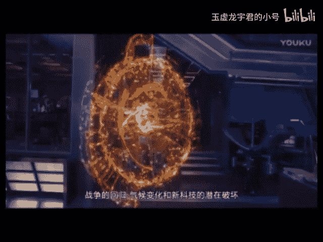

因为这书的利润吧不符合市场规律啊。

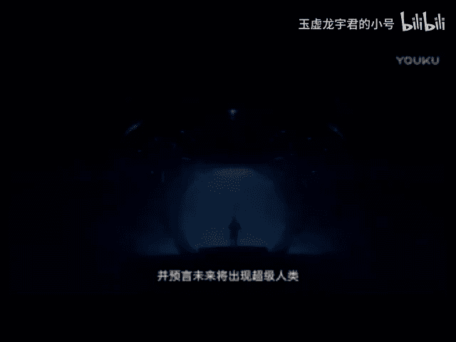

当然这只是未来的一种可能性，按照这个逻辑咱们还能推出另一个未来。

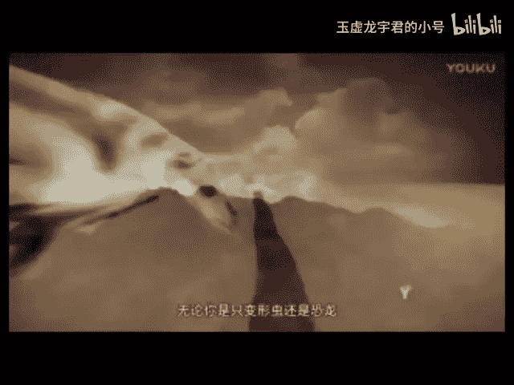

没错，无用阶级对于精英阶级来说已经没什么利用价值了。

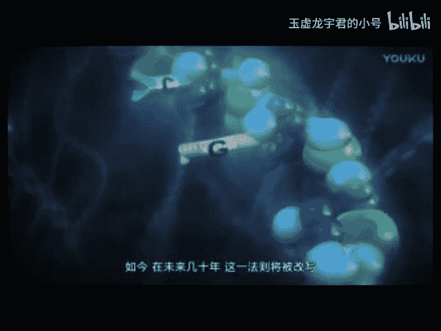

维系他们关系的最后一根纽带也断掉了，但是咱们要辩证的看问题。

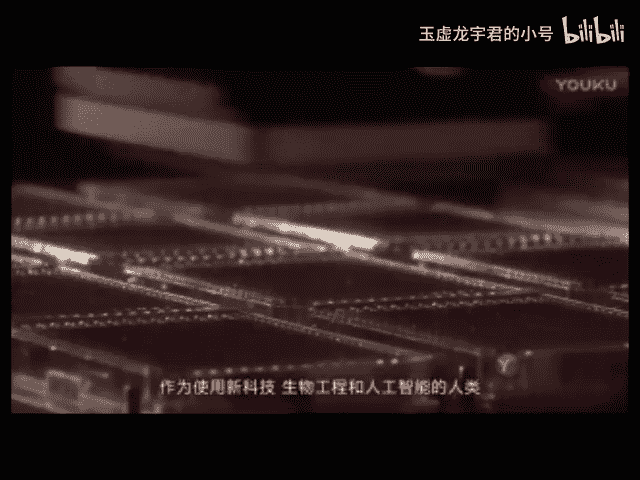

无用阶级至于无用阶级，他们之间还是有互相依存的关系的。

对你没价值的东西对我来说是有价值的，那么既然对你已经没有价值了。

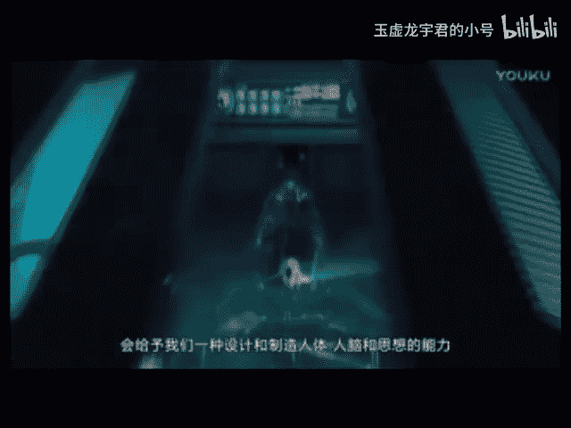

为何我们还要待在一块呢，那么精英阶级跟无用阶级这两个的社会关系就会必然割裂。

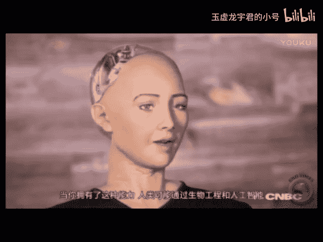

几百年前美国人因为不满英国那边的阶级固化，而到美洲独立建国。

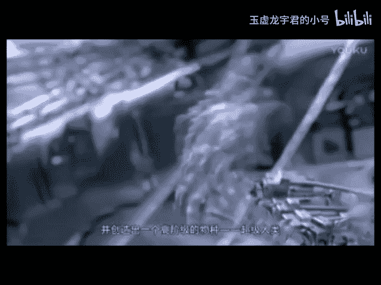

既然无用阶级跟精英阶级已经没什么瓜葛了，那么为什么还要待在一块呢。

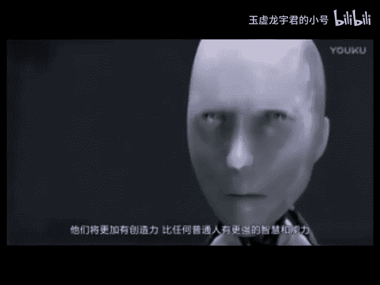

届时可能会分裂成两个族群，跟机器人生活在一块被圈养在城市里的一帮精英阶级。

以及独立出来自给自足。

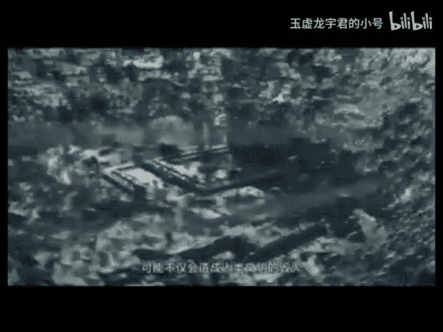

开始回归传统社会的无用阶级，换句通俗的话讲。

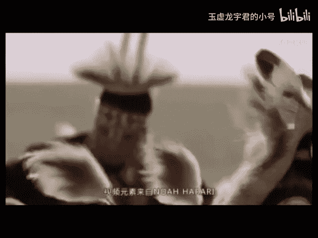

我对你已经没有利用价值了，我又没法从你那得到什么，那么我们干脆各干各的老死不相往来。

岂不是更好，因为我们之间的利益纽带已经消失了。

所以干脆各自圈地自蒙得了，显然尤沃尔赫拉利并没有认真读过资本论。

而是基于西方资本主义社会宣传的那套价值观来思考问题。

才会写出这本跟科幻小说一样的《未来简史》。

但如果懂经济的再往下深退一步就会发现。

资本主义的掘墓人其实也蕴含在这部《未来简史》中。

净性书不如无数，《未来简史》跟《货币战争》一样，当一部小说来看完全是OK的。

但真如果觉得那就是现实，未免会误人误己。

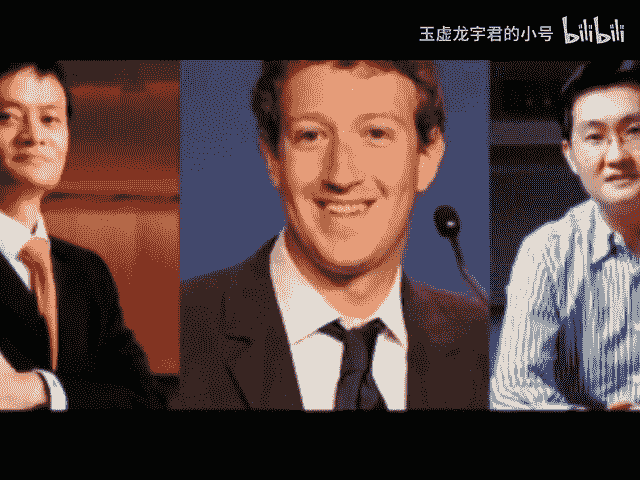

不过已经有一批经济学术圈的大佬在怼这本书了。

所以也就只能当小说来看看了，好了 这是同道联盟 我是龙哥。

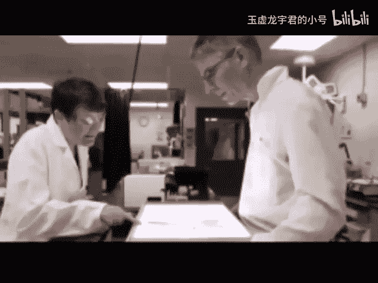

还是求硬币关注弹幕支援，咱们下期再见。

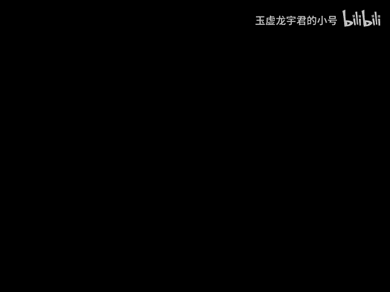

外星人遇上鬼 建国后不许成精。

用科学的角度破除封建迷信。

外星科技和地球灵异现象究竟能擦出什么火花呢。

敬请期待。

敬请期待。

敬请期待，敬请期待，敬请期待，敬请期待。

