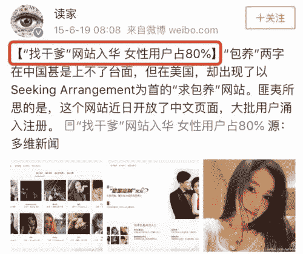

<!--yml
category: 未分类
date: 2023-04-18 22:39:41
-->

# 为什么很多女大学生找干爹_风闻

> 来源：[https://user.guancha.cn/main/content?id=104848](https://user.guancha.cn/main/content?id=104848)

文：周冲 来源：

[周冲的影像声色](https://mp.weixin.qq.com/s/2w1v8reKZyFFRIX_eDM-LQ)

看公众号久了，你会有一种错觉：**天底下女人，个个都是大女主。**

**经济独立，人格也独立。**

只是现实总是令人失望的。

**从激昂的口号中走出，来到窘迫的现实里，你就会看见更多女性，像藤蔓一样活着，或渴望像藤蔓一样活着。**

****

**别的不说，在一个**安全的、不审判的、可以令人直视内心的**环境里，你去问一个女性：**

> **“亲爱的，**
> 
> **有个企业家/大佬/集团CEO很喜欢你，**
> 
> **他想和你在一起，**
> 
> **他愿意每个月给你5万块钱，**
> 
> **给你租一套高级公寓，**
> 
> **你不用上班，可以做自己喜欢的事。**
> 
> **你愿意吗？”**

**如果在公号留言区回复，她一定会说：**不愿意。****

**但是，如果是在真实生活里，多数人**最终所做的选择，恐怕就不是“不愿意”这个选项。****

****

**2012年，美国出现了一个包养网站。**

**它叫Seeking Arrangement。**

****

**一经推出，注册人数很快突破100万，甚至一度登上APP下载榜首。**

****它的创始人说，****爱是穷人发明的一个概念，一见钟情是令人发抖的童话故事，虚幻且不长久。****

**同时说，**女性与有钱人达成包养契约，比通过感情去索取和奉献要诚实、公开和透明多了。****

**他自己的亲妹妹，也曾在这个网站上“求包养”。**

**他觉得很正常。**“抛开道德，理性来看待的话，不过是一种供需关系。******”******

******创始人的三观，注定了Seeking Arrangement成为一个不体面的交友网。******

************

********在这里，男人女人速配与否的关键，就是钱。********

****男人注册后，会写明自己的收入，提出自己的包养预算。如一年100万。****

********

****女人注册后，会写明身高、体重、三围、才艺、特长、是否是处女，同时提出自己的包养预期。如一年50万。****

********

****如男人女人在包养金额上达成一致，就完成了速配。****

****是的，网站不看你们价值观是否一致，性格是否相合，是否有同样的爱好，同样的背景，相似的教育经历......甚至不看你们是否有眼缘。****

****只看钱。****

******我的出价你认可，我的叫价你接受，我们就是一对。******

******男的就成为糖爹。******

********女的成为糖宝。********

********他们可能还会以干爹和干女儿互称。********

******速配之后，就会线下约会。******

******至于约会的内容，想必大家不用猜也能想到了。******

******之后，干爹会满足干女儿的物质需求。作为报答，干女儿也要提供呼之即来、挥之即去的某种服务。******

******《纽约时报》评论Seeking Arrangement称：******

******“它不是社交工具，简直是下九流的网上青楼。******

******有钱老男人和年轻女子在此进行钱色交易，他们不寻找长期的灵魂伴侣；他们希望通过货币进行交易：财富，青年和美丽。”******

********但网站会员们认为**，**它让老绅士解决了寂寞困扰，让女孩解决了生存问题，是一种双赢。********

******于是糖爹糖宝源源不断加入。******

********

****一个糖宝说，最初的时候，她只是因为好奇，在网站上填了自己的资料。****

****没想到一发不可收拾。****

****一些老男人陆续搭讪。****

****“我可以帮你解决学费。”****

****“我可以给你爱马仕。”****

****“我可以给你钱。”****

******尝到了赚快钱的快感后，她再也不想付诸努力。******

******不想学习，不想工作，觉得任何需要用心用力去做的事情，都无法接受并坚持。******

****她有两个糖爹。一个在外地，一个在同城。凭借援交，她背LV，穿香奈儿。****

****而糖爹们呢？也获得了某种生理和心理上的满足。****

******这似乎皆大欢喜。******

********可是，所有轻而易举就能实现的物质或性，必然也带着轻而易举就会到来的危险。********

************

******2013年11月30日，51岁的谷歌高管弗里斯特·蒂莫西·海因斯，在这个网站上速配了一个女人。******

******她叫蒂克曼。******

******谈好了价钱以后，他们在加州邻海上的游艇中约会。******

************

******当天，海因斯死了。******

******死于吸毒过量。******

******他是世界名企的高管，5个孩子的父亲，一个妻子的丈夫，就这样死于自己的纵欲无度上。******

******通过警方的调查发现，那个援交女子见证了他死去的过程，但没有出手帮助过一次。******

******同时，警方还发现，蒂克曼的前一任53岁的金主，也死于相同的原因。******

******这桩连环案，一度引发轰动。******

******后来，蒂克曼被判刑6年，入狱。******

************

******看到这里，你大概以为，蒂克曼是一个非常贫困的女孩。******

******其实并不是。******

******她父亲是一个成功的商人。家中有钱，自己也是白富美。******

******她本可以走上更光明的路，但她不愿。******

********“过上等生活，付中等劳力，享下等情欲，”就是她的人生所求。**于是，她和其他糖宝一样，多次在SA上找糖爹，沉迷于这种交易中。******

****她曾有过犹豫么？****

****应该也有的。****

******有一个电影名叫《她们 Elles》，讲了一帮援交女孩的故事。******

****其中一个女孩说：**“我好几次都下决心不做了。****可是，它就和烟瘾一样，很难戒掉它。”******

********

********

********

********

****浪子回头，妓女从良，多是人们一厢情愿的愿望。****

******真正的现实是，只要赚到了这种钱，女孩们就会被诱导着，往一个方向走：****不断地爬上不同的床，想停都停不住。******

******除非她卖不出去了。******

****她们中多数人的末路，都是这一种——****

****到了30多岁，糖爹一个个解除了关系。她们吃不了苦，也没有公司愿给一份offer。****

****于是她们将自己打折，继续卖。****

****原来的报价是一次500美元，降到300美元，以保持自己的基本生活需求。****

****后来报价又降到100美元一月，80美元，50美元......无限地低下去，贱下去，但还是很少有人来关注。****

****再老一些，如到了40岁，50岁，怎么办呢？****

****在昏沉的路口，公园广场的角落，一些老年站街女凑上独自出行的老男人：“10元一次，来不来？”****

********

****2015年，Seeking Arrangement有了中国版。****

********

****虽然这个网站、APP、服务号后来都经下架。****

****所属的公司也查无踪影。****

****我在此就不多提了。****

******值得一提的是，不论是美国版的SA，还是中国版的SA，都有一个奇怪的的现象。******

****那就是，**女性注册会员远远高于男性。******

******美国版的SA网站，女性会员是男性会员的10倍。******

******中国版的SA网站，女性会员占80%。******

********

****而这些女性会员，大多数都是女学生。****

****《每日邮报》统计过“求包养”的人数，发**现500万用户的网站上，有200万人都是在校学生，大都在通过“性关系”来换取“包养费用”。******

****SA也曾公布数据称，男性用户中40%为已婚男性，1/3的女性用户为在校女学生。****

****这些女学生不少来自名校。****

****《赫芬顿邮报》称，**纽约大学位列第一，剑桥大学名列第4位，哈佛大学名列第7位，很多人还在常青藤大学里读研......******

********

********为什么？********

******为什么女孩们更容易接受床上交易？******

******为什么高学历女性，还是会接受这种快钱？******

******为什么名校背景，还是抵挡不了形而下的诱惑？******

******你可以说有社会原因。******

********如经济危机，学费高，生活成本高，工作机会少，投入的时间与精力又过大。女孩们“太累了”，也“太穷了”，只有走上这种道路。********

******但我觉得，更多的是文化原因。******

************

********一，笑贫不笑娼的社会潜意识。********

******在正邪难辨、是非难分的灰色现实里，你会发现有钱男人都有一两个情人。******

******提及这些情人，**看客对“她真有钱”的在意度，远超于“她被包养”的在意度。********

****在这样的判断标准下，许多女孩都会利用美色谋生。****

****而被包养后，她们也不会认为：**我是被包养的。******

******她只会认为：****我只不过交了一个有钱的男朋友。******

******她有一千种理由，合理化自己的交易。也有一万种方式，享受大家的羡慕与嫉妒。******

******环境对“娼”的宽容，自己对“娼”的接纳，都在心理层面上，弱化了包养的道德压力。******

********

********二，懒与贪。********

******人总是懒的。******

******年轻女孩更是如此。******

********我一度以为，当代年轻女性，大多数很上进。****但自己带了团队以后，发现并不如此。********

******80%的女孩，都厌恶劳动，厌恶竞争，厌恶KPI，厌恶绩效，厌恶压力，只想用最少的劳力，换取最多的回报。******

****她们要轻松，来钱要快，要多，要不费心。****

****最好是不劳而获，被人像伺候大爷般伺候着......****

******于是，做小三，被包养，秘密援交，成了这些女孩最好的选择。******

********

********三，爱比不上钱重要的认知。********

********爱与婚姻，也走下了神坛。********

******爱不再神圣。****在很多人眼中，一夜情 × 时间 = 爱。******

******婚姻不再必须。****结婚率逐年下降，离婚率逐年高涨，出轨率一路飚升，约炮软件下载量遥遥领先......这些都告诉我们，婚姻重要性早已下降。******

******而钱，却成了穷忙族最在意的点。******

****于是SA一直交易火爆。****

********

******只是我们忘记了一件事，包养并非一个很好的投资。******

****在这种关系中，**你会成为贬值品，而非增值品。******

******你的价值逐年下降。******

******你得不到职业成长，不具有稀缺性，也没有核心竞争力，被替代性太高。******

******而因为通货膨胀，你的钱也在逐年贬值。******

****古往今来，大家可以看看，因为“性交易”而走上人生巅峰的有几个？****

******屈指可数。******

****成功概率太低。****

********

****在SA网站上，不少高学历糖宝，只拿到了仅比上班族多一点的收入，**却赔进去了大量机会成本。******

****回报少，代价大，隐患重重。****

******——她们会染病，心智会扭曲，再也没有动力去追求诗与远方。******

******等到年龄红利也失去时，回头一看，曾经一起求学的同学们，都已成为各行各业的精英，呼风唤雨，资源丰富，什么都有了，什么都有可能。******

****而她自己在人世的夹缝里，哭不出，怨不得，只有默默吞咽恶果。****

******面对SA以及类似于SA的这种事，更好的态度应该是怎样的？******

****我想告诉大家两句话。****

****一句是在电影《LOVE》里，舒淇告别豪门，选择自力更生时说的：**“我不接受包养，我只接受爱。****”******

************

************

******另一句是一个身家千万的女创业者说的。当年她站在校门口，回答那个老男人：**“我相信，到了你这个年纪，我会比你更有钱。****但今天我接受了你的包养，这一天就永远不会来。”********

********所以，姑娘，****不要在床上，错失一个时代。********