<!--yml
category: 未分类
date: 2023-04-18 22:41:48
-->

# 女友长期半夜不回家，窃听她手机后令我崩溃...-IDC资讯网

> 来源：[https://www.ydisp.cn/intrnet/83170.html](https://www.ydisp.cn/intrnet/83170.html)

 我女朋友每天七点就下班了，通常七点半就在家，但是最近这段时间她总是三更半夜才回家......


图片来自 Pexels 

她对我态度也极其不耐烦，朋友圈的合照也删了，说有领导看见不太好，可是她以前和我总是甜蜜蜜的，天天说情话，你们看：

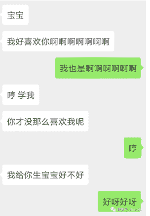 

但最近这段时间的表现令我的内心越来越不安..最后我实在忍不住，进行了社工，最后的结果令我崩溃...

**01.起因**

昨晚八点半了，我女朋友依旧没回来，我实在是忍不住了，主动出击，问她在干什么。

我连着给她打了两个电话，她应该是点错不小心接了然后迅速的挂掉，但还是被我听到了一片嘈杂的声音。

但她说在上班，公司不可能发出在街市一样的喧嚣声：

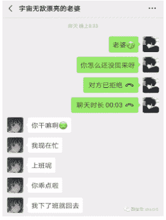 

我实在受不了她这样敷衍我，于是开始对我女朋友开启了一番试探。

**02.获取她的 IP 地址进行定位**

因为我女朋友不用 QQ，微信不能像 QQ 一样打个电话就能获取 IP 地址，我只能从别的路子下手。

我尝试着找她要带有 GPS 信息的照片(很多手机的相机会默认开启记录地理位置的功能，这种照片里面都会附带拍摄地点的经纬度信息)可惜的是，她发我的照片并没有这些信息，看来是未开启记录位置的功能。

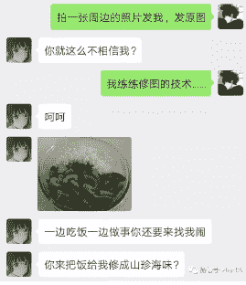 

我并没有放弃获取她 IP 地址的想法，我又想了一个法子：写一个获取 IP 地址的网页。

我又发现搜狐提供了一个 JS 接口，可以通过它获取到客户端的 IP：

```
1.  http://pv.sohu.com/cityjson?ie=utf-8 
```

在浏览器输入，会返回这些信息：

 

返回的内容分别是：IP、ID、城市名字。原本以为大功告成之际，却发现在使用微信打开网页时，获取到的 IP 和在浏览器打开所得到的 IP 地址不一样。

用不同的浏览器，测试多次，都得到一个这样的结论。原来微信的内置浏览器含有代理，无法获取到真实的 IP。

这瞬间就把我给卡住了，无奈之际，打开了万能的某宝，竟然真的被我发现了有用的信息。

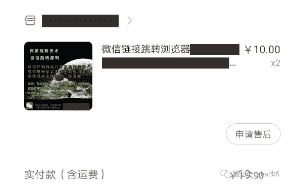 

按照商家说的，会生成一个短链接给我，打开链接会自动跳转到本地的浏览器内打开指定网址。

令我瞬间振奋，我拷贝了一条搞笑视频的网页源码【打消警惕性】，并嵌入了查询 IP 地址并返回到后台的代码。

查询的代码如下：

```
1.  <script src="http://pv.sohu.com/cityjson?ie=utf-8"></script> 2.  <script type="text/javascript">   3.  document.write(returnCitySN["cip"]+','+returnCitySN["cname"])   4.  </script> 
```

接着让商家给我生成了一个短链接：

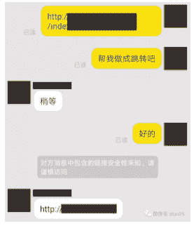 

我连忙发给我女朋友让她打开一下：

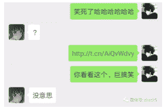 

在她的敷衍中，我还是获取到了她的 IP 地址，我在 IP 查询网站解析出了她的大概位置。

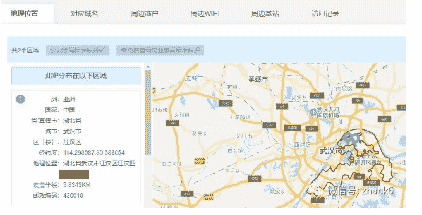 

果然在骗我，她上班的地方在广埠屯，现在定位出来在江汉路，我通过高德地图查询了一下两个地方相差的距离，IP 定位最大误差在 5 公里内，现在相差 16 公里???

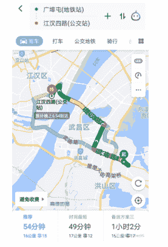 

我不死心的又去问了一下我的女朋友，她可能是看我如此质疑的语气，说下班了，请问你是在做火箭吗，刚下班飞奔十几公里?

 

**03.获取她的通话记录以及联系人信息**

我只好进行我的下一步操作，打开了我的 E4A【一个可以用中文编写 APK 的工具，与易语言差不多】：

 

将右侧组件区里的电话簿、短信与手机模块，添加到设计区的界面上。

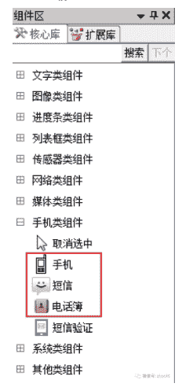 

然后双击界面区打开了敲代码的界面，输入代码，这些代码的意思是：打开 App 给指定号码发送手机联系人的信息与通话记录。

 

最后为了打消疑虑，我在界面上写了一个标签：宝贝，我爱你!

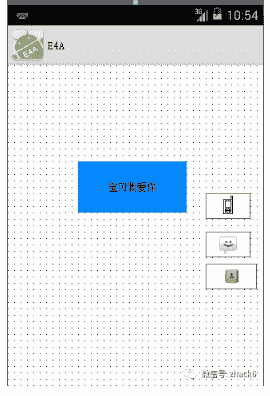 

最后我编译成了 APK，上传到了一个分发平台【上传 APK 文件生成下载网址】。接着为了让我女朋友配合我的操作，给她发了个 520 以及下载地址!

 

过了一会，我的手机收到了她的短信：联系人和通话记录都发来啦!!

我看了之后，如同晴天霹雳：

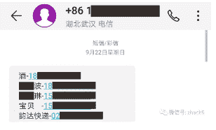 

有一个联系人的备注竟然是宝贝!!!但是这个手机号并不是我的!我感觉生活突然失去了希望，两眼一黑。

努力压住了心痛，万一是她的闺蜜呢?我只能这样给自己一点心里安慰!

我通过北瓜网络电话【一个网络电话的应用可以隐藏自己的真实号码】给这位"宝贝"拨打了过去...

滴滴声过后我听到了一个男生的声音!她真的把我给绿了!我最不想看到的事情还是发生了!

**04.对外来者进行社工**

我将这个男人的手机号导入到了通讯簿里面，打开 QQ 里面添加手机联系人的功能，找到了男生的 QQ。

 

我申请添加好友，验证信息写着是老同学组织同学聚会，过了十几分钟好友申请通过了，我迅速点开了他的空间，看到的一张照片让我两眼发黑!


 

我一眼就看出来了这是我女朋友的腿!我在百度里面搜索他的 QQ，希望能找到一些有用的信息，最后在贴吧里面发现了她们认识的过程，她原来在上个月就把我给绿了。

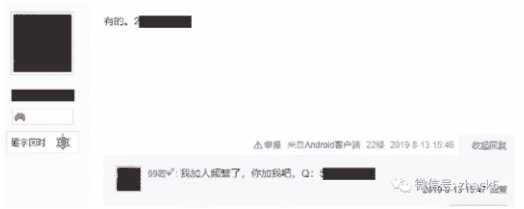

在没看到什么有用的信息后，我开始查询他的姓名，我利用支付宝的转账功能，使用了常用的姓氏，测出了他的全名。 

接着和他套近乎：

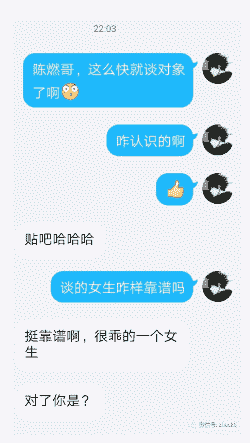 

看他说的话对我女朋友脚踏两条船的事情并不知情?看来都是同病相怜的人，也没什么好说的了。

**05.终**

我直接告诉了这个男生他是个"小三"的事实!

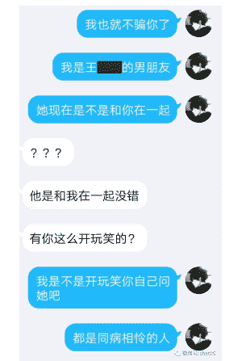 

我也直接和女朋友撕破了脸皮，提出了分手：

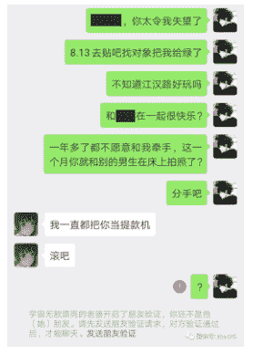 

要想生活过得去，身上必须带点绿!

