<!--yml
category: 未分类
date: 2023-04-20 17:04:12
-->

# 曾经有几十万人在线喷人的 QQ黑界，如今成了扩列带师的韭菜田|界面新闻 · JMedia

> 来源：[https://www.jiemian.com/article/4017598.html](https://www.jiemian.com/article/4017598.html)

> 文|差评

前几天，后台有一条留言吸引了差评君的注意：有人用一个叫“ 黑界 ” 的社交圈子在搞未成年人传销。。

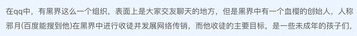

作为一个互联网十级冲浪选手，差评君不得不承认，还真没听过什么 “ 黑界 ”。

留言中的 “ 血樱 ” 啊，“ 邪月 ” 啊，俩名字看上去挺中二的，不会是什么恶作剧吧？

但“ 收徒 ”“ 传销 ”“ 未成年 ” 这几个词密集地堆到一块，实在让人心生警惕。。。

于是乎，差评君毅然决定潜入这个神秘的组织，认真探个究竟。

作为准备工作，差评君先找到几个网站想恶补一下黑界的知识，补了一会儿便有种信息负载过大的赶脚。。。

先得纠正一下，黑界并非一个组织，而是许许多多组织的集合。它没有一个正式定义，综合各种说法，我们可以说它是00 后在 QQ 上构造的一个假想的成年人世界。

00 后们对黑界的狂热素来已久，黑界真正创立的时间已经模糊不可考，但大致指向遥远的 2008 年。。。

而爆料人提到的 “ 血樱 ” 就是黑界中的一个组织，用黑界行话说，应该说是一个家族。

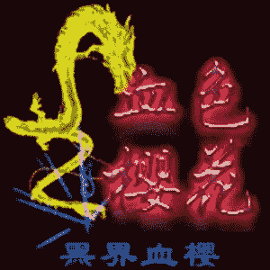

通常来说，黑界的家族由总创、高管和一般成员组成，总创和其他人素以师徒相称。

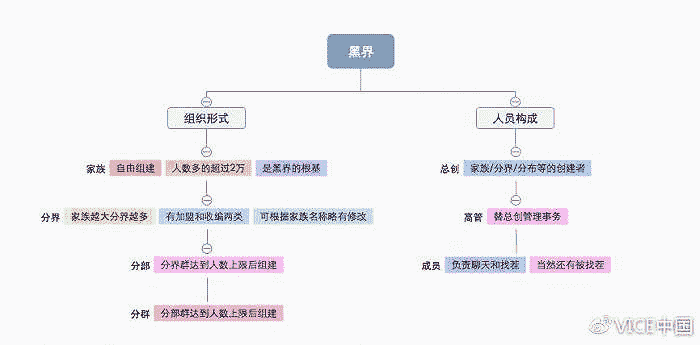

*来源：VICE中国*

在 QQ 昵称或签名档加上家族或师父的名字，是家族成员的特权和体面，彰显身份和地位。万一遇到找碴儿的，也可以充当保护伞。

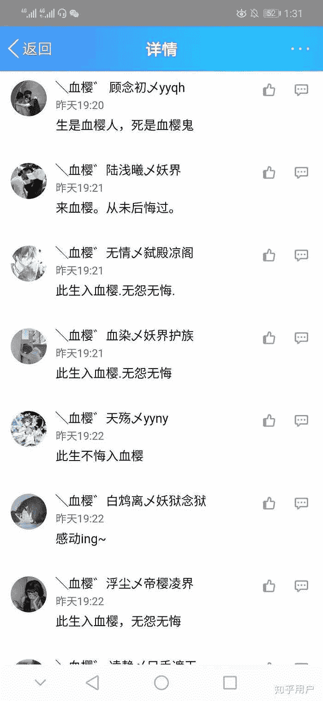

网上一些犄角旮旯，向来流散着黑界家族各年度的排行资讯，上面的据说全是当年赫赫有名的家族。

什么 “ 微笑 ”家族、“ 情战 ”家族、“ 柔杀 ”家族、“ 血樱 ”家族、“ 亡尸 ”家族、“ 魔道 ” 家族，不一而足。

而这每个中二的族名下，还会附带一段若有其事的极简版家族往事。

争战杀伐▼

风月情殇▼

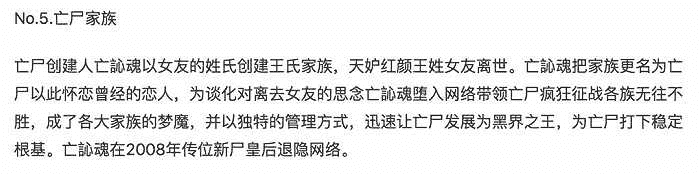

看着这些介绍，差评君很想问一下：“ 海藤瞬，是你吗？”

在黑界，那些兴旺的家族的族人挤满了几十甚至上百个 QQ 群。而家族规模往往是家族人气、战力的直接体现。

族战每天都在发生，因为这是壮大声势、收编落败者的重要手段，决定输赢必须借由一个低智的竞技项目，叫“ 打讨论 ” 或 “ 扣字 ”。

简而言之，就是拉 QQ 讨论组，族战各方派代表进组打字互喷，打字更快的一方算赢。。。

因此，在黑界中，“手术 ” 这个词也有了新的含义。

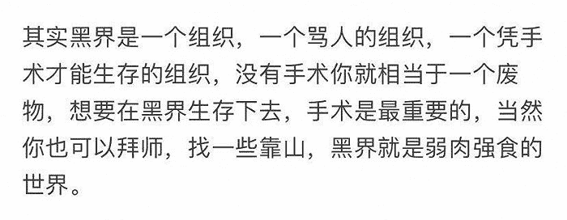

在黑界家族之战中，少年们一言不合就开启祖安模式。。。

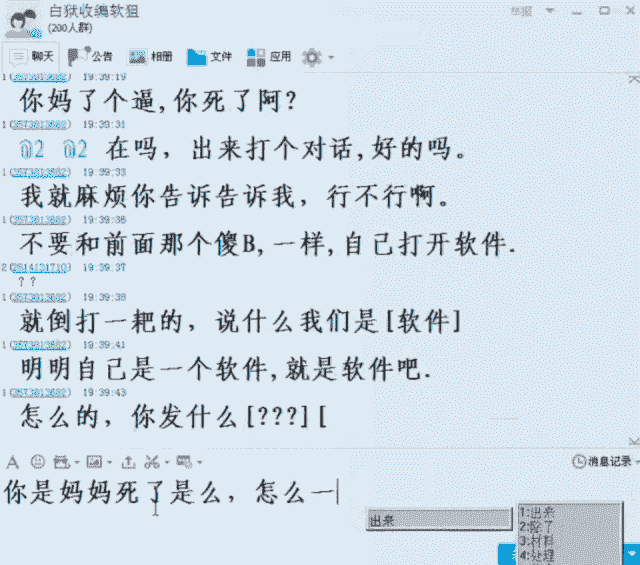

据传黑界在鼎盛期有几百万人，同时在线打讨论的也有几十万，但这两年，人数规模和活跃度只有过去的十分之一，很多事或都被忘记了。

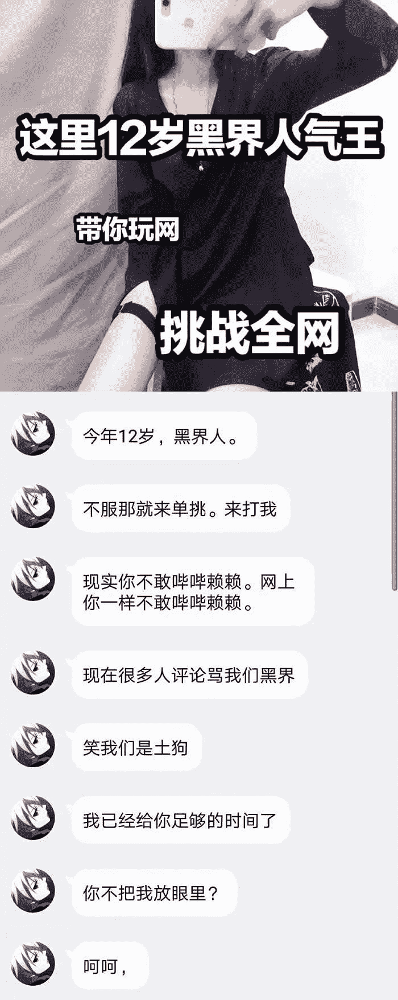

在一个黑界QQ群，差评君认识了一个叫 “ 林萧辰 ” 的人，自称黑界总创之一 “ 苏艺卿 ” 亲传弟子，他的 QQ 空间新上传了几个打讨论的录屏，看起来有几把刷子，所以我决定拜他为师。

林萧辰收了我40元，把我收为徒弟，他教导我说，在咱们黑界没有什么宏伟使命， “ 就是靠知名度、人气而骄傲 ”。

QQ 空间每天的访问量上 800、每条说说的浏览量、点赞量过 1500、又开了什么什么钻，都是骄傲的资本。

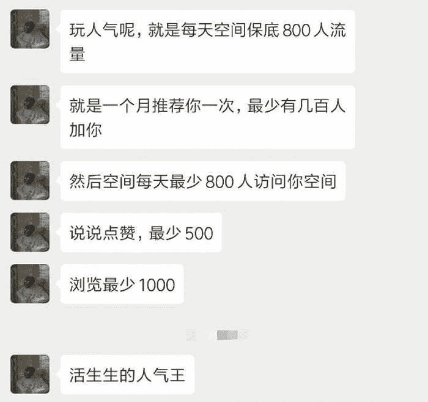

说着，差评君居然感受到了“ 师傅” 的傲气。

除了 40 元的收徒费有点不正常，其他的看起来也没有什么特别的嘛，哪个中二少年不是虚荣的呢~

然后，差评君试着向林萧辰提了 “ 邪月 ” 这个名字，只想知道后台留言里的那个邪月是否真有其人。

没成想，他厉声呵喝，“ 那个现在已经成什么 b 样了？那已经不算是血樱了，那完完全全就是圈钱的。”

在某个黑界家族排行的网页上，差评君也找到一行小字：

“ 邪月成操纵血樱的大佬，基本是拜师送钱成高管，血樱几代总创的付出结局只出为傀儡，长期以收徒圈钱已让血樱名声和排名不断下滑。”

此时，之前后台留言的老铁，正好甩给我一个 QQ 群二维码，群名叫 “ 邪月教你如何在黑界立足 ”，有 1200 多人，00 后占了近七成。

而 QQ 群主，正是 “ 邪月 ”。看来差评君可以直接接触邪月了，顿时有点心疼刚才那 40 元拜师费。。

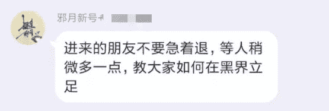

过了差不多两小时，眼看人数到了 1600，邪月先是要求大家加上 3 个 QQ 号。

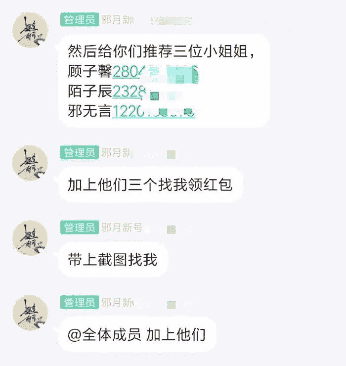

？加 QQ 还有红包拿？这不是撒钱么？

差评君依言加了三位 QQ，但只拿到了 6 分钱。。

然后，邪月就开始吹自己了。

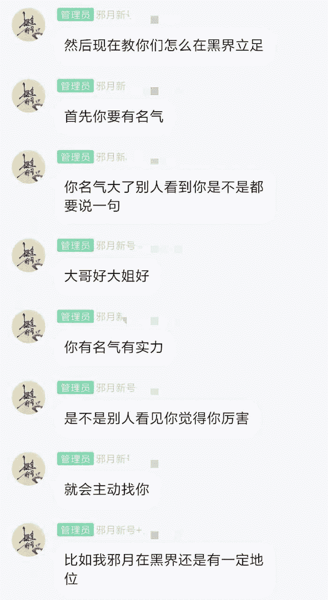

接下来的操作就有点奇怪了。

邪月的十几个徒弟轮番介绍自己，说今天收徒弟，减价大酬宾啊，有意可以私聊什么的。

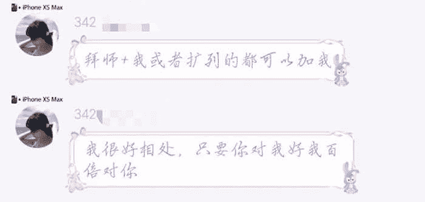

画风很快走了样。

一个小哥哥，说要找一个 “ 亲传徒弟 ”加入他的网赚事业，边上人气边赚钱，日赚 100 +。不光收徒，他还顺便叫卖起了盗号木马。。。

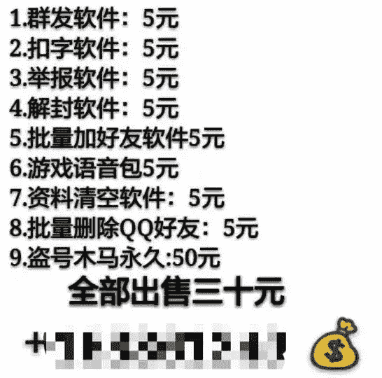

然后一个微商小姐姐，说加上她的微信送美甲贴，问跟她能学点啥，她说只能教做微商，先交 300 元预定从 “ VIP代理 ”干起。。。

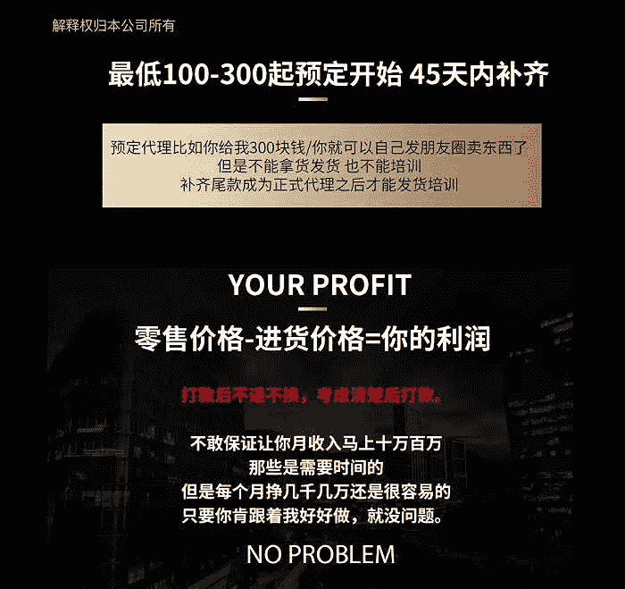

说好的学打讨论、扣字呢。。。这么快就暴露本性了么？

问了几个人，原来邪月每天中午都会新建一个 QQ 群，然后把群码发到一个将近 2000 人的家族群，家族群里的人会很快行动，把扩列好友拉进来。

他们拉人进群有什么好处？邪月规定，在新群中，只要拉过人进群，就有打广告的资格，拉的人越多，发言的顺序就越靠前。

几个小时后，就会进行上面那个流程，推荐、废话、打广告。

对了，邪月一开始推荐的那 3 个小姐姐，应该是付了 50 块钱才有这个曝光机会的。

更骚的是，打完广告，邪月把 QQ 群卖了，直接进账 50块。。。简直是个黑界商业鬼才。。。

按每天推荐 3 个人、每个人 50 元，加上那些收徒的邪月弟子打广告的费用，还有晚上把群卖掉的 50 元，至少躺赚 200 元啊。。。

而邪月也大大方方承认，说自己就是在赚黑界的钱。

之前后台留言的老铁见到一张邪月晒在 QQ 空间的钱包截图，显示邪月在 2016 年共收到了大约 165 万元的红包。

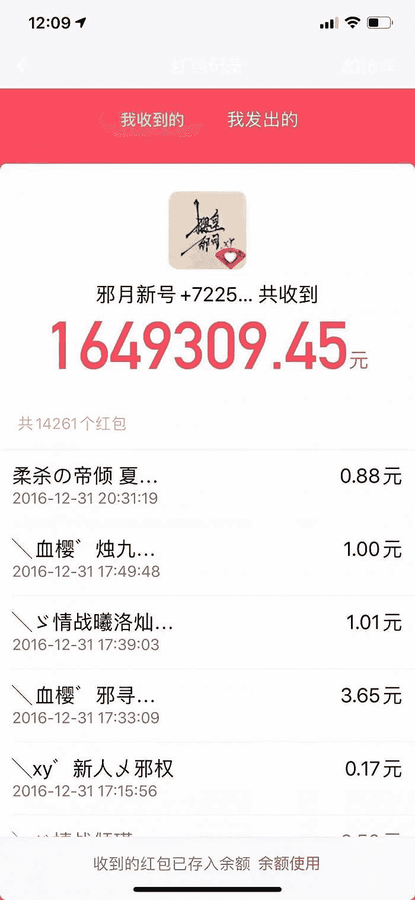

他觉得很诡异，于是把这个事告诉了差评君。

在差评君看来，熟稔流量价值的邪月，就是这个匿名世界的皮条客。

他利用少年们对黑界的猎奇、血樱的光环，大肆建群拉人。转手却开始出让广告位，把还在幻想如何在黑界立足的中二少年，引向别有用心的人。

而在早期，黑界有头有脸的人物谋利手段很克制，仅限收徒，几十块拜师钱，没人在乎，他们更享受虚荣带来的快乐。

那时的00 后们也把黑界看成了一个现实飞地。

他们可以在这里找人聊天、cgx（ 00 后黑话，处关系 ）、玩角色扮演，受了欺负可以找代打讨回颜面。

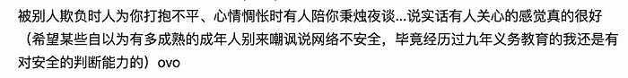

没有靠的上的关系，学好智能 ABC 输入法，也可一人之下万人之上。

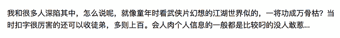

族战是无止境的，但在这件无趣的事上也会动感情。

在 00 后的这个成年人世界，提升名气、人气才是主要目的，加入大家族、打赢讨论、找人 cgx 、扩列，都指向这一点。

但当早年的那批 00 后即将受成年礼，越来越接近现实的成年人世界时，他们嗅出了黑界的商业价值和变现可能。

收徒的名目更丰富了，拜师钱水涨船高。

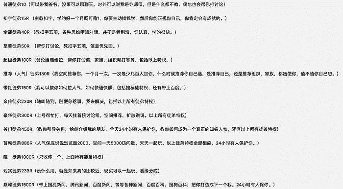

黑界、电商带货无缝衔接。

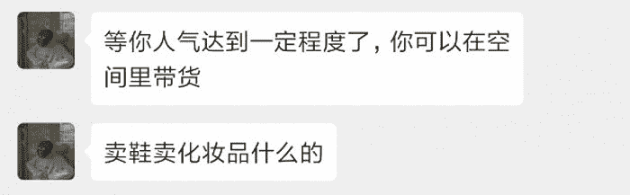

但是邪月这一批人，直接把黑界少年引向了罪恶的边沿。

这个事的可怕之处在于，黑界是一个价值观混乱的场域：人生的目的、过程被简化，成功的定义和路径被设定得非常荒谬，罪恶的行为被美化甚至赞许。

涉世未深的黑界少年们，很可能会把邪月当作神祇，把他的话奉为圭臬，把拉皮条看作 “ 上人气 ” 的必由之路。

而邪月没有教导过这些欲成王成龙的少年，网赚十有八九是杀猪盘，盗号要承担法律后果，某些微商的把戏很可能涉嫌传销犯罪。

很多当年玩黑界的少年慢慢长大，如大梦初醒，离开了这个乌烟瘴气的虚拟世界。

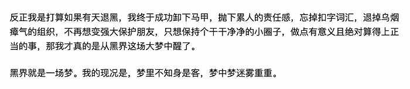

有人后知后觉，自己早已出离现实太远。

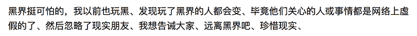

还有当年的黑界大佬，QQ 早就被家长收缴，昵称都改换成了 “ XXX 妈妈 ”。

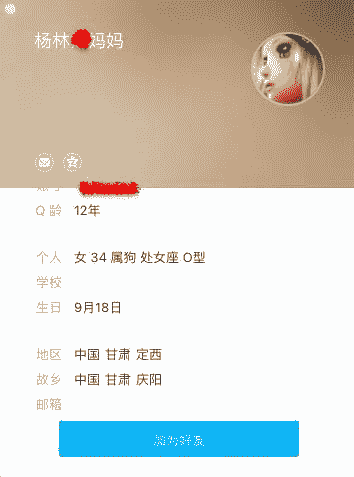

第二天，当我把微商的事告诉林萧辰时，他对我说，最好不要信，大部分是假的。然后，他跟我分享了一段他去年买手机被坑的事。

有一搭没一搭地聊了一会儿，我问他，你师父那么厉害，怎么退网了？

他回我，要现实啊，网络终究是网络。

