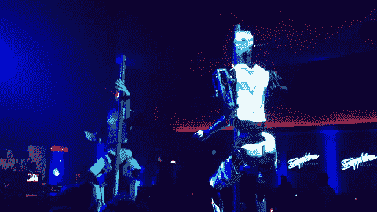
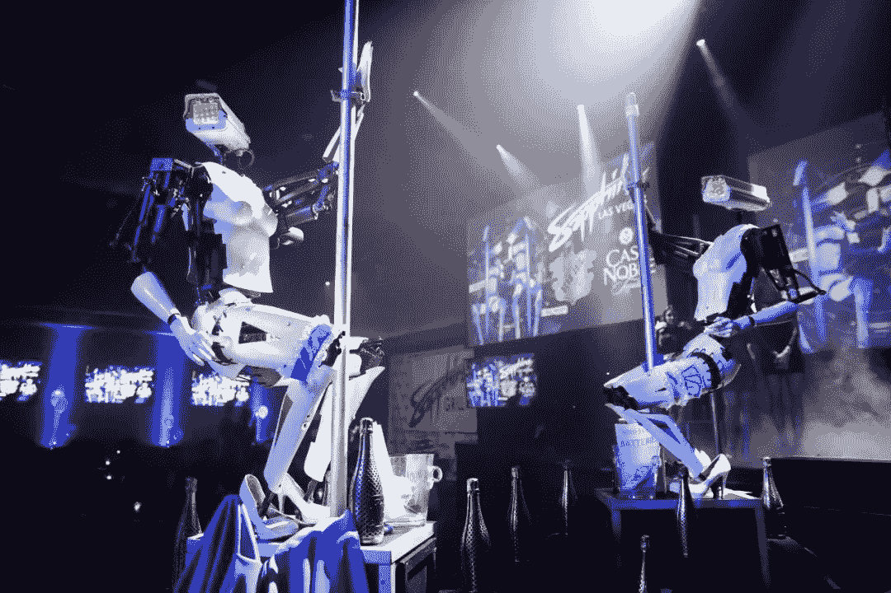
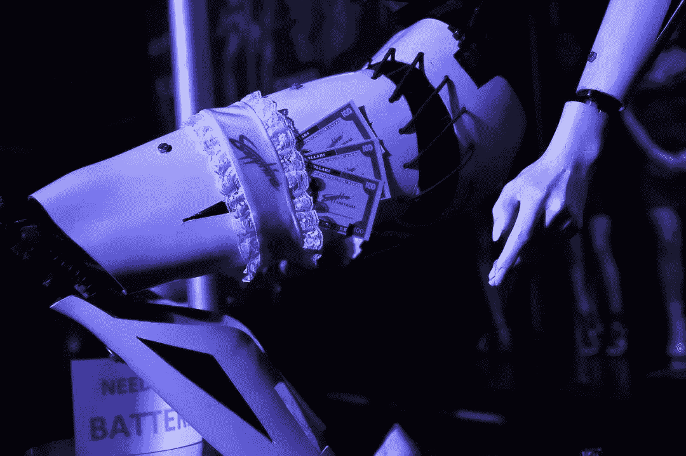
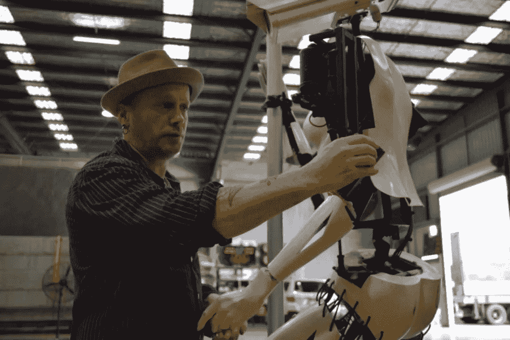
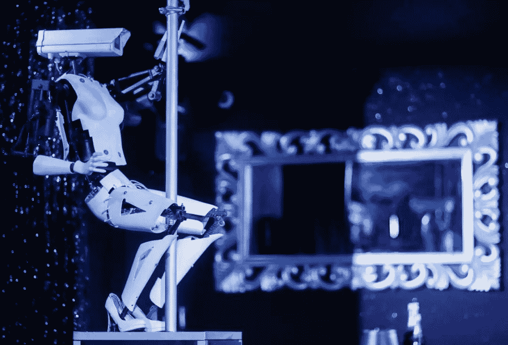
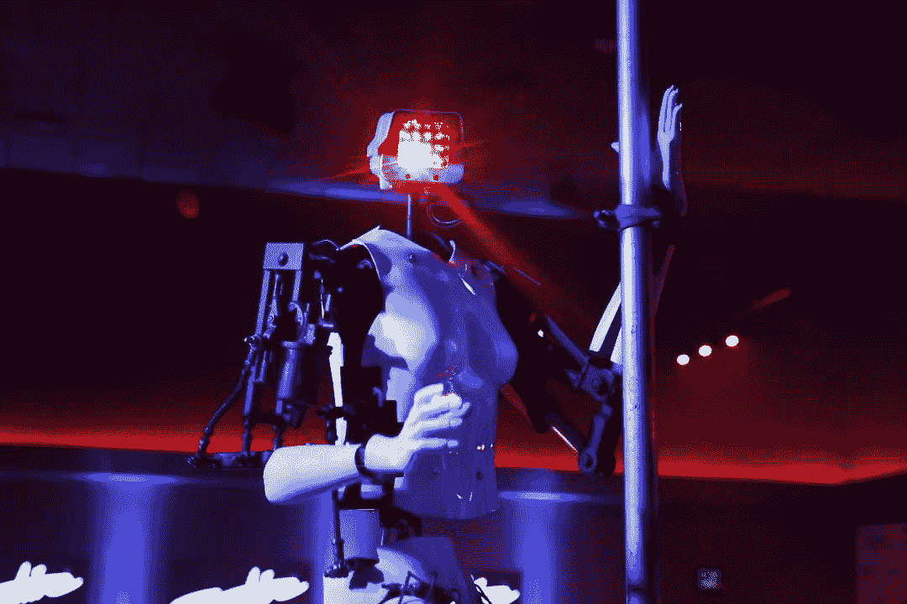
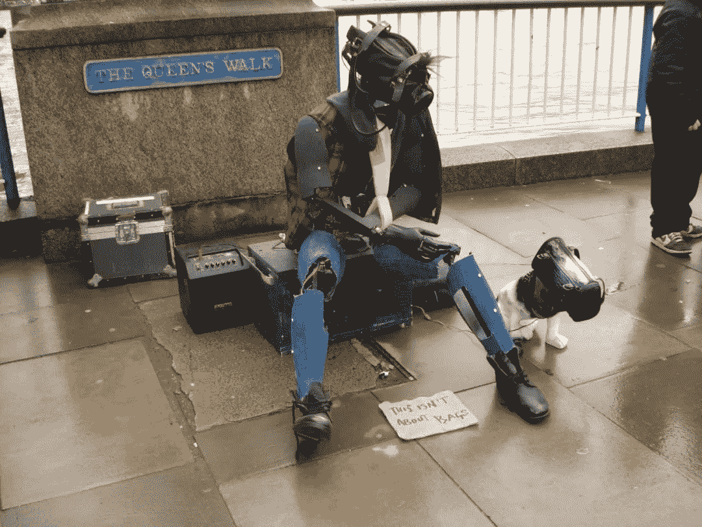

<!--yml
category: 未分类
date: 2023-04-18 22:46:38
-->

# 机器人跳钢管舞，岂止是性感

> 来源：[https://mp.weixin.qq.com/s/WF-Zat9yCeLE7aogYhh_rw](https://mp.weixin.qq.com/s/WF-Zat9yCeLE7aogYhh_rw)

法国当地时间 9 月 3 日，位于法国南特的一家俱乐部，为了庆祝其成立五周年，老板请来了两位特殊的表演嘉宾 —— 机器人。**它们是被力邀而来的钢管舞表演者**，将在这家俱乐部进行为期一个月的驻场演出。

钢管舞，是近代风靡全球的舞蹈，因为火辣的舞姿和充满力量的节奏，常常被冠上诱惑和色情的标签。

让机器人来跳钢管舞，你能想象出是怎样的画面吗？事实上，机器人不仅掌控了舞台，还征服了所有来宾。

**机器人钢管舞吸引了很多人的关注**

对于这个仿佛科幻影视中的场景，俱乐部的老板表示，此举不只是为了制造舆论，更是为了向机器人和科技致敬。

和机器人通常给人「冷冰冰」、「硬邦邦」的感觉不同，这对机器人演员能跳出性感妖娆的舞姿吸引观众。

伴随着音乐和节奏，在绚烂的灯光下，**两个机器人握着钢管，灵活自如地扭动躯体，展现着它们娴熟的舞姿。**不仅如此，它们还能够打出勾引人的手势，发出诱惑的声音。

**机器人在现场热舞**

这款机器人**仿照人类模特的体型打造，**支撑和传动的机械结构，被洁白塑料的人体模型外壳所包裹，**外形上凹凸有致，**此外，它们还配有特殊的**高跟鞋，**在腿部配饰了吊袜带。

但似乎是为了故意不和真人混淆，机器人具有镂空的身形和特意显露的连接线，而头部，则是直接采用了**会发光的闭路电视摄像机。**

虽然和娴熟的人类舞者相比，舞技还有些差距，但机器人似乎已经掌握了钢管舞的一些关键动作，如 M 字腿，扭臀等。在舞台上，它们和真人钢管舞演员同台演出。

**被观众打赏的美元，左下角的牌子上写着****「需要钱买电池」**

在动感的节奏和昏暗的灯光里，跳钢管舞的机器人吸引了不少人的注目，一把把钞票被撒到舞台，或者塞到了**机器人的蕾丝裤缝里**。

这对机器人出自英国艺术家 Walker 之手，在 2012 年的一个展会上首次亮相，此后这款机器人陆续参加多个活动，进行着展览和表演，逐渐被人们所熟知。

去年，钢管舞机器人开始量产并被大规模推广。

**作者 Walker 正在调试机器人**

Walker 是个**热衷于建立动态机器人的废金属艺术家**，热衷于从废弃的材料中，通过艺术的角度，赋予它们生命和意义。

而这款跳舞机器人，同样使用废旧材料制成，**报废车的雨刷器**，改造成了机器人的马达，提供了驱动；**头部是监控摄像头**；身体则用**汽车零件及假人偶**拼凑而成。

而它的舞姿，需要依靠特定算法和程序驱动，**基于 Android 开发，根据高级舞者的动作，进行了机器人舞蹈程序的编写。**

**对于机器人的「销魂」舞姿，观众也是贬褒不一**

Walker 表示，他制作机器人的过程其实很简单，重要的是最后的调试。

客观来看，这个机器人没有特别逼真，也没有精致的仿人类面容，仿佛是靠着机械化的驱动，人体模型部位在做着被编译的动作。

但不论是令人眼前一亮的销魂舞姿，还是机器人艳舞这一吸睛的主题，都让跳钢管舞的机器人备受关注。

**机器人的天然冷酷似乎增添了几分气质**

但 Walker 自己也说道，「姿势」中的细节是跳舞机器人的灵魂，肢体的微小动作和移动，会让人恍惚它们就是真正的舞者。

作为一个艺术家， Walker 的野心，可不仅仅只是成产出一个夜场尤物。

这款跳钢管舞的机器人，最大的亮点其实在于它那「明目张胆」的摄像机头部。

**机器人通过摄像头也记录着人们的举动，颇像一种行为艺术**

Walker 解释道，在几年前，他注意到监控摄像被用来广泛地应用，在城市里，越来越多的隐私都被暴露在摄像头下。

为了由此他产生了**研究「窥视欲」的想法，**随后产生了钢管舞机器人的念头，他希望通过安装的摄像头，来观察人们的窥视，并抗议处于监控和偷窥下的隐私。

通过这个摄像头，观察者和被观察者，角色也发生了对调。

**Walker 的另一款作品：****无家可归的流浪者**

根据 Walker 的个人网站介绍，他在欧洲各地旅行时使用废料场中的材料，已经进行了三十多年的设计创作。通过加入动力马达以及新的技术，他正在将废弃物打造成炫酷的作品。

他制作出的机器人，往往聚焦在社会的边缘文化群体：失业者，无家可归者，性工作者。

比起一款受人关注的钢管舞机器人， Walker 似乎更在意**科技带来的深度思考，科学技术的发展和人性的较量。**

而艳舞机器人独特的摄像机头部，不由得让人想起尼采的那句名言，「当你凝视深渊，深渊也在凝视着你」。

**再看我，再看我就把你。****。****。**