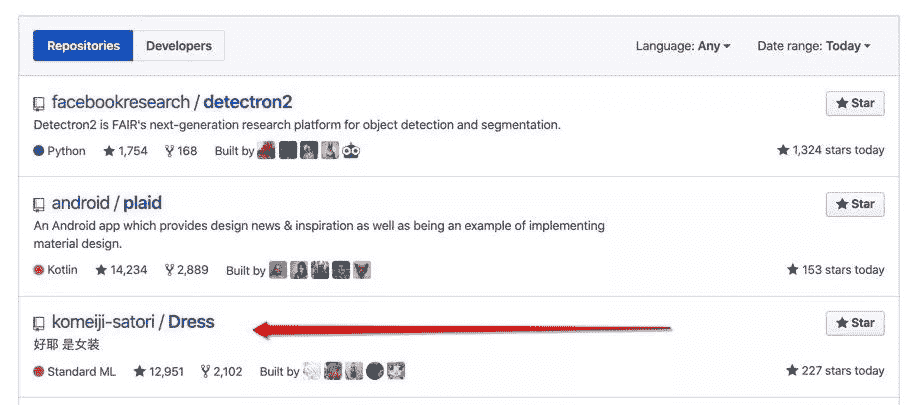
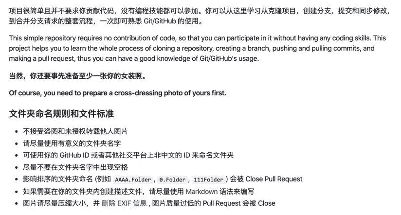
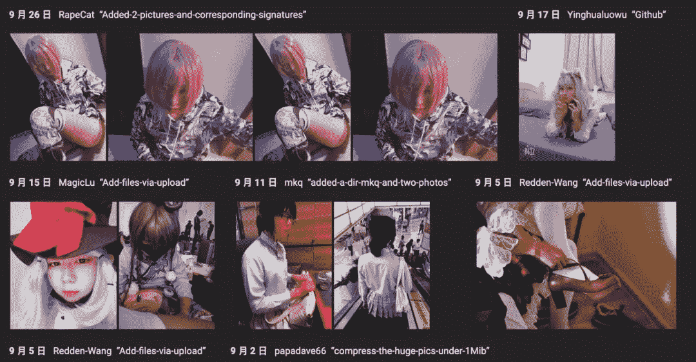

<!--yml
category: 未分类
date: 2023-04-18 22:44:43
-->

# 程序员女装大佬们，你们太可怕了！

> 来源：[https://mp.weixin.qq.com/s/ysrbTzj1kCzdLqSrpfbxSA](https://mp.weixin.qq.com/s/ysrbTzj1kCzdLqSrpfbxSA)

作者 | loonggg 

来源 | 非著名程序员

最近这两天我发现程序员女装的开源项目又在 GitHub 上火了起来，今天高居日榜的第三名。

可能有很多程序员对这个开源项目不太熟悉，其实这个开源项目虽然程序员大佬们都在不遗余力的男扮女装，贡献着自己的女装照片， **其实质就是想让大家可以从这里学习从克隆项目，创建分支，提交和同步修改，到合并分支请求的整套流程，一次即可熟悉 Git/GitHub 的使用。**

只不过是要求大家在练习学习 GitHub 使用的时候，必须贡献出自己的一张女装照片才可以被收录（PR）。

你说什么？**这个开源项目的本质其实不是让大家学习 GitHub，就是以学习的名义让大家来贡献女装照片？本质就是女装照片。**哈哈，被你看透了。

不过话说回来了哈，这个开源项目绝对是接地气，再一次证明我们程序员的幽默，风趣，解放天性的一面，绝对不仅仅是闷骚，还有的是无聊！哈哈……

特么程序员们玩的确实牛逼，我看大佬们的女装照片，感觉比网红都漂亮，不信你们来看看。

牛逼的程序猿们，简直了，还专门搞了一个网站，专门把上传的这些照片整理成了相册，我特么刚才在里面看了半天，陶醉的不行，看整体网站的风格，我特么都感觉自己是在浏览 PornHub 。

**咱不得不说，程序员们真他娘的是群人才。**

不想女装的男程序员不是一个好 giter，谁说女程序员少？请看上面，各个都是女装大佬，这不比 new 对象强啊！

好了,我知道你们肯定猴急了,开源项目地址在这里，赶紧去吧！

地址：https://github.com/komeiji-satori/Dress

**什么你们要看我的女装照片？不对，我本来就是女的啊，如果这篇文章你们能够转发到 10 万+ ，我就给你们在公众号上发我的照片。（玩就玩个大的）**