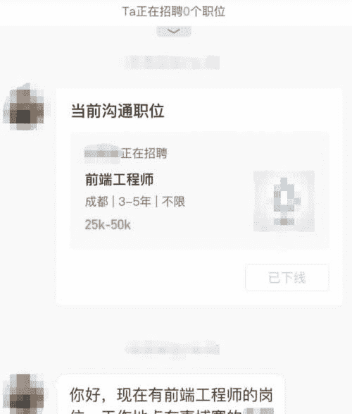
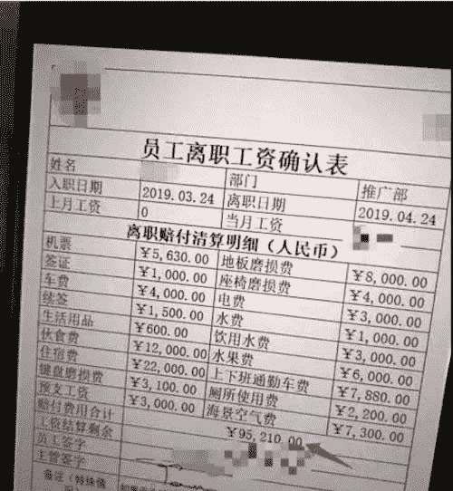
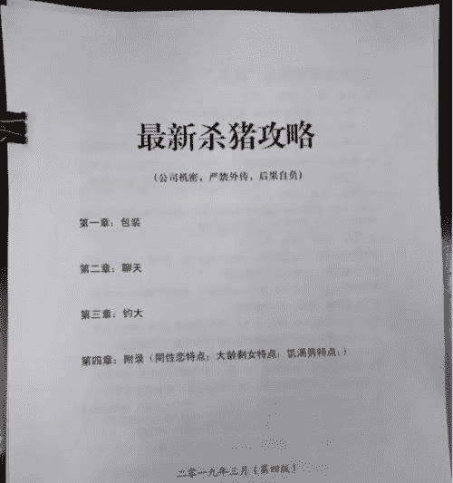
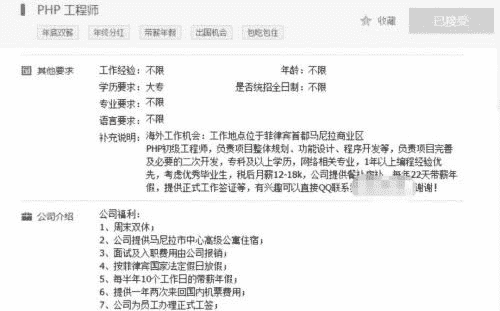

<!--yml
category: 未分类
date: 2023-04-18 22:48:19
-->

# 那些被骗去柬埔寨的程序员有多惨? - 卢松松博客

> 来源：[https://lusongsong.com/info/post/12070.html](https://lusongsong.com/info/post/12070.html)

昨天，我失联了两年的好哥们，从柬埔寨回来了。

他飞机一落地，我就收到了他的[微信](https://lusongsong.com/tags/WeChat.html "微信")：「老子终于回来了」。

我这个哥们的职业是[程序员](https://lusongsong.com/tags/chengxuyuan.html "程序员") ，业务技术很好，两年前一个美女猎头给葫芦打了电话进行安利，他就响应柬埔寨出海的热潮，去了西港 (西哈努克港)一家「游戏公司」。

当初离开去海外掘金之前他告诉我，柬埔寨那边的公司承诺给他开5万人民币的月薪，比阿里P7月薪都要高。

他走后，每次看他[朋友圈](https://lusongsong.com/tags/pengyouquan.html "朋友圈")发西港的海景房别墅、菲佣、中国大厨做的饭菜，几个程序员同行们都非常羡慕，在微信群里各种讨论@他出来，吵着闹着要去柬埔寨[工作](https://lusongsong.com/tags/gongzuo.html "工作")，但这小子从没回复过。

昨天他声泪俱下说「老徐，我朋友圈的内容都是假的，你一定要写写柬埔寨技术魔窟，别让国内的兄弟们去送死了!」。

于是，就有了这篇文章。

本文皆为我哥们的真实经历，为了保护其本人，起名代号「葫芦」，很多地方、代号均采用化名。

### 01

提起柬埔寨，大家一般会说它是旅游胜地，穷，中国人多。

但很少有人知道，在一片美景的背后，隐藏着全球臭名昭著的**诈骗中心、黑产工厂，而这些搞诈骗的老板，绝大多数都是中国人自己同胞。

不是每个人，都有葫芦这样的好运气，能活着从魔窟逃出来。

高薪，美景，美食，美女，从不996，这就是一个彻头彻尾的圈套。

葫芦一直把自己的招聘简历挂在网上寻求跳槽机会。

而猎头却将葫芦的简历卖给了远在柬埔寨的几家**公司，其中有一家叫「AAA」的公司选中了他。

这家**公司获得葫芦的个人资料后，中国HR抄着熟练的浙江口音跟他打了电话，让从小生活在包邮区的葫芦倍感亲切。

大家不知道的是，「AAA」公司背后储备了全国不同省份的HR，随时可以跟应聘者讲家乡话，拉近距离，获得信任。

一位叫蓉蓉的HR联系葫芦说，他们是一家专门做游戏的柬埔寨公司，同事大多是中国人，工作语言不是问题，业务沟通很方便。

对方表示，这个岗位每个月工资开五万人民币，只要面试能过。

葫芦一开始带着极强的戒心，因为他的水平在国内正常日常价也就20k每月，怎么到了东南亚就翻了一倍还多?

但紧接着操着北京口音的技术面试官对他进行了远程电话面试，整个面试过程专业度很高，对方对技术的问询也显得十分专业，甚至还有一些业务层面的技术讨论。

面试电话结束，葫芦心头的疑虑和不安感直接消除了。

他有两个问题在电话面试中没答出来，但面试官最后还是给了通过。

这让葫芦非常兴奋，当天还发了朋友圈庆祝。

他说这是他靠技术走向财富自由的幸运起点。

但殊不知，他即将要成为[21世纪互联网时代的「黑奴」](https://lusongsong.com/info/post/11620.html)。

### 02

葫芦买了机票到达西港的当天，一辆黑色面包车等候在机场外专程接他，一同上车的还有几位也是从国内来的程序员。

在挨个和HR蓉蓉签了合同之后，他们就被她以办理入职手续为由，拿走了 护照和身份证。

这是限制人身自由的第一步。

紧接着第二步，坐在后座两侧的浑身文身的中国壮汉起身，给他们挨个套上了黑色黑头套。

当时葫芦所在的这辆黑车上，有个程序员见状激烈反抗。

这个程序员立即摘了头套，拉车门要跳车逃跑，并声称要报警。

车倒是马上就停了。

但迎来的是纹身壮汉的一句话：「你要是死在这里，我把你护照烧了，你家人连你的尸体都找不到」，接着就是手q子弹上膛的声音。

葫芦和车内的其他程序员心凉了，头上不停的冒汗，要跑路的那位兄弟据说当场吓尿了裤子，老实了蹲了下来。

一路上车内静悄悄，没人再敢说话。

这种随时会被一枪爆头的状态，就是这批出海程序员的日常体验。

葫芦入职的这家「AAA」公司，隐藏在西港的豪华酒店中。

整个7、8层都被「AAA」公司包了下来。

7层是办公场地，每天会有酒店的工作人员前来送餐。

8层则是员工睡觉休息的地方，作息统一安排，平时任何人不得随意离开走动。

这两个楼层电梯两侧都有持枪的 保安 日夜把守，此外上下楼的电梯卡，只有公司的保安队长有。

为了保密，任何人不得以任何名义在工区内用手机拍照。

如果你拍照，轻则被打一顿，重则要被电击。

所有新人在分配好房间、办公座位后就开始了工作。

办公环境堪比集中营。

每个月工作时间也并非HR所说的休息8天，而是每天996，一周只休息半天。

只有休息日可以被放出酒店，但又被规定只能在工区附近5公里内自行行动。

而西港当地最近的警察局在10公里外。

稍有不听话，就会被开枪打死，半夜被保安们把尸体运下楼，处理掉。

报警也没用。

**和色情产业在柬埔寨是合法的，当地政府只管税收和贿赂，不管闲事。

因为中柬警方曾经合作过一次扫赌，差点摧毁了柬埔寨的经济。

所以后来柬埔寨对**公司都是睁一只眼闭一只眼。

所有员工都是苦劳力，麻木的被逼写代码，一行又一行。

这里才是真正的黑砖窑。

### 03

在「AAA」公司工作一个月后，葫芦发现整个公司都在做**，根本没有当初面试所说的游戏项目。

工资高是高，但是月末总会被以各种理由扣的一干二净。

葫芦所在的组是开发组，大家几乎都是从国内被骗来的程序员。

因为**[网站](https://lusongsong.com/tags/wangzhan.html "网站")的特殊性，需要大量的程序员去完成各种棋牌项目。

葫芦的同事就经常因为写出bug造成公司损失，惨遭毒打。

因为身份证护照被没收，又面临随时挨打电击，没人敢轻举妄动。

葫芦的直系领导，在「AAA」公司干了8年，是公司的主程，现在终于熬到可以每年可以回家探亲一次了。

面对这种24小时被监控，上缴身份证和护照，随时都会保安被毒打的公司。

动不动就有人掏出枪指着你。

想从这里面逃跑太难了。

### 04

不过有买方市场，就有卖方市场。

于是，在当地衍生出了一种专门护送中国劳工回国的公司。

他们会以假身份、偷渡等各种方式帮你回国。

救你可以，你得先交钱，没钱就要签新的欠款协议。

当然，这笔佣金，可能比你直接从**公司离开，所交的赎身费还要高。

甚至些护送公司，就是当地的**公司专门成立的。

本来你以为你借助护送公司逃往了国内，但实际上你可能会被卖给另外一家**公司。

一环套一环。

我朋友葫芦算是出海「黑奴」中极其幸运的一个。

当时「AAA」公司去迪拜开分部，葫芦眼看同事天天在这里被打，自己也没有机会脱身。

决定借去迪拜看看那边的情况，于是就主动报了名。

他在迪拜飞机刚刚降落时，趁着负责「押运」员工的保安收拾行李的功夫，从队伍中跑了出去。在机场一路狂奔。

柬埔寨黑枪盛行，但押运的保安却没有办法在另一个国家持枪。

葫芦在迪拜机场躲了一天一夜，买了回北京的机票，总算是得以逃出升天。

### 05

除了被骗去的技术工种，还有很多其他的劳工也被关押在**公司。

比如推广劳工、HR劳工、还有帮忙控场的保安。

推广组主要负责诈骗，通过固定的骗术，邀请猎物进行**。

也就是黑产中常说的杀猪盘，瞄准的就是性需求没有被满足的男性。

推广员过QQ或微信加你后，时不时给你发图露个奶，说要跟你在一起。

7-15天，获得信任后，对方会说自己在玩一种包赢的下注游戏。

经过人群筛选、聊天信任这个环节后，绝大多数人都会下注。如果你表示想要收手，对方会用各种借口来威逼利诱。

比如说你没志气，不放心跟你在一起，让你想想两个人的未来。

比如让你再买一千块的，强调包赢，如果你买了她就明天飞你在的城市，色诱你。

通过种种手段，你回过神的时候，可能已经赔了好几千了。

人的赌性这时候就被激发出来了，为了赢回白白亏掉的几千块，会杀红了眼。

接着就是输掉一万、十万、一百万，借光身边人所有能借的钱。

被**网站榨干所有钱后，原先跟你恩恩爱爱，撒娇不断地女孩子却突然消失了。

这整个过程被**公司称之为「杀猪」。

更惨的是，这些「女孩」正是远在菲律宾被关起来当奴隶压榨的黑劳工。

这些推广组的黑劳工被定的KPI定的非常的高，他们每个月要完成100单。

葫芦所在这家公司，推广员每次成功后，会有3000元的提成奖励。

而低于一百个，每少一单要克扣3000元的工资，所以有不少失败的狗推会被送回国内。

带着几十万的债务，还都是欠的公司的，你还必须偿还。

还不起?借高利贷啊。

又被套进去了。

### 06

打开[知乎](https://lusongsong.com/tags/zhihu.html "知乎")搜索柬埔寨、菲律宾等关键词，很多提问都是关于高薪聘请，已拿到offer，问要不要去的。

还有很多普通人，正走在通往黑魔窟的路上，但他们自己浑然不知。

因为柬埔寨的**业非常[赚钱](https://lusongsong.com/tags/zhuanqian.html "赚钱")，柬埔寨的**公司们最缺的是推广员和程序员。

加上**公司本身人员流失率高，所以他们给HR定的业绩目标非常高。

完不成就要挨打加扣钱，超额完成的还有提成。

所以这些西港的HR们不顾节操，只要能把你忽悠过来，什么都愿意做。

不少HR们会在boss直聘、拉勾这类招聘网站上用国内的公司注册账号。

然后一个招聘信息也不挂出来，偷偷摸摸的私信很多程序员，问对方愿不愿意来柬埔寨做游戏。

其中做HR拉人头最著名的是一个叫王美玲的人。

这位王美玲的条件是，只要你过来入职，我就跟你睡觉。

每骗来一个她就能获得5000元的提成，她每个月能骗来20多个。

据行内人说，她最后得了艾滋。

另外有些已经被骗去的员工，会为了躲避挨打和获得一点自由放风的时间，就给国内的朋友打电话，坑骗自己的朋友过去一起「赚大钱」。

有的则是国内的培训机构，打着培训完包就业、送实习的旗号，送一些自学JAVA培训的大专生出国门给**公司做工奴。

被骗去的大多都是年轻的男生，他们有的刚刚有了孩子，有的是刚刚学计算机毕业的大学生，有的是受不了996加班的国内[互联网](https://lusongsong.com/tags/hulianwang.html "互联网")公司的码农。

大家说到底是为了能赚点钱，赚点经验，赚点未来，养活自己，养活家人。

恋恋不舍离开故土，鼓起勇气想要博一个明天。

谁能想到此去面对的，是随时会被人一枪打死的人间炼狱呢?

### 07

这几天发文前，葫芦又突然发微信说，文章不要发了。

但最后他几经心里斗争，为了避免更多人上当受骗，还是让我发了。

葫芦好歹是逃回了国内，倘若还在国外，恐怕这笔封口费就变成了爆头了。

那你说，看到这样的招聘需求，你还会去吗?

作者：徐车长 来源：互联网翻车指南