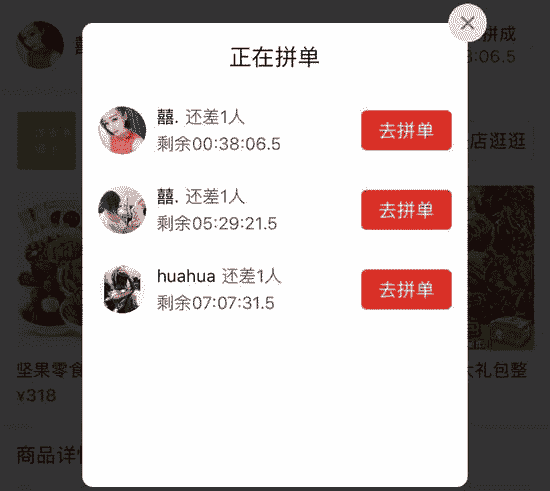

<!--yml
category: 未分类
date: 2023-04-18 22:40:30
-->

# 骗局：我在探探上24小时内遇到的25个骗子|探探|骗局|社交软件_新浪科技_新浪网

> 来源：[https://tech.sina.com.cn/i/2019-03-30/doc-ihtxyzsm1894353.shtml?cre=tianyi&mod=pcpager_focus&loc=14&r=9&rfunc=100&tj=none&tr=9](https://tech.sina.com.cn/i/2019-03-30/doc-ihtxyzsm1894353.shtml?cre=tianyi&mod=pcpager_focus&loc=14&r=9&rfunc=100&tj=none&tr=9)

　　来源：“满身铜臭”公众号

　　作者： 满身铜臭的我 

　　作为一个在互联网行业讨口饭的人，我之前一直默默关注着探探的成长**。**中国从2010年到2019年已经经历3个完整的社交风口周期，但是没有一家可以跑出来，加上最近老罗的子弹短信也黄了，所以有了微信之后再无社交的说法。

　　但是近期传闻探探要拆分上市，这让我又开始关注起探探。（探探于2018年被[陌陌](http://stock.finance.sina.com.cn/usstock/quotes/MOMO.html)以6亿美金收购）

　　探探划一划相互匹配的方式，无论是男生还是女生都有一种皇帝选妃的快感。女生有女生的快感，男生有男生的欢乐，总之提供了一种比较好的陌生人社交场景。快捷、迅速、便捷，完全看脸不讲技术含量。

　　众所周知探探和脉脉都是利用熟人圈最先启动的，他们读取了通讯录之后通过几百种话术来唤醒和拉新用户。

　　刚开始你收到这种短信你肯定会选择性屏蔽，但是奈何不了人家发的频次够高，且不用一个短信通道发，召回言语够又非常有挑逗性！

　　直到我在国外又接到了一条探探的短信提醒，四下无人于是决定尝试试用一下探探。谁知这是我人生有史以来最灰暗的24小时！

　　作为一个长相仅达到及格线的同志，我仍然决定大胆的把自己的身材和照片放上去，于是我登录上了探探发现所有的头像都是这样的。

　　后来我才发现我注册的时候选错了性别，于是重新选了一下性别并且头像过了认证之后，来到了探探的主界面。

　　小姐姐果然非常多！头像里的女孩子啊我感觉在实际生活中都没见过！也可能是美女都是晚上出来，我这种穷比创业者打死也看不到。

　　功能也极其简单，左滑讨厌、右划喜欢。可是我划了半小时都没有和女生匹配上，结合自己前十几年悲惨的个人经历，我得出了还是自己长相的问题。

　　痛定思痛，为了划到自己匹配的对想象我迅速列出了解决方案：

　　1。只要是女生我都点击喜欢增大进入流量

　　2。用Python写一个小工具缩短手工操作时间

　　3。去淘宝上买了一组男生生活套图，后来发现真的很贴心还附带小视频。

　　4。买了一个自动回复的脚本减少沟通的导入期。

　　秉承“Python自有黄金屋，Python自有颜如玉”的理念，在网上简单了解了一下“前人的经验”之后找到了一段很牛逼的代码。

　　跑了一下，效果还是很不错的！但是为了防止自动化程序，探探还是做了很多障碍。尤其是没有充值会员的用户只能每天划50次，没办法只能先充值一个月的会员。

　　程序跑起来的时候效果飞起。很快就有了很多人添加了我！程序放在那半小时就有了236个匹配！

　　于是我就尝试性的开始和匹配的女生聊聊天！我突然发现所有的女生都很热情啊！和我在现实生活中看到的不一样啊！大家都很友善啊！果然互联网可以解放人的天性啊！有直接要求加微信的！

　　也有聊了不到两分钟就相谈甚欢，直接把微信号甩过来！让你猝不及防地加她微信！此刻的我真的感受人生到达了巅峰！

　　甚至还有连中国人最传统的问候——“吃了吗”都不让我打出来！就把微信发出来给我！我仿佛发现自己是一个未被开垦的处女地！（原谅我真的只会这么问候）

　　陆陆续续加了很多人在微信之后，我就开始进行深度沟通，探探加的很多女生完全和身边的女生不一样，从来都是女生先很主动，每天早上问你吃了吗？晚上问你睡了吗？一种温暖油然而生！

　　我仿佛是一个大明星如走秀一般在各个聊天界面中游刃有余的穿梭。

　　直到突然有一个女生给我说她想和我聊天，还是视频聊天！羞于颜值的我，内心其实是抗拒的，但是考虑到身处国外的内心孤寂，于是想视频就视频吧。结果女生却让打开一个直播地址。

　　进去这个小蓝莓尚柿直播之后，女生就要和我连麦，可是我看了一下想要和主播直接连麦，需要达到五级+点亮+守护女主播，连之前映客直播都没玩过的我又因为有事就和这个美女完美错过了。

　　第二天另外一个美女发了一个朋友圈，这萧瑟、这忧伤，让作为正常男人的我有了呵护她的冲动，这个美女也是要和我在直播间里聊天，于是我愤然点开了直播间。

　　点开之后我只能说不好意思打扰了！可能我的要求还是比较高，女孩子还发语音要求我加入她的工会每日给她守护（大概人民币150元/天），看了一下自己2500的工资卡之后，我果断婉拒了美女的好意。

　　后来我发现每一个我加的女孩子都希望通过直播聊天室和我聊天，这让我不得已下了很多直播软件。

　　有一个让我送很多小花花的女孩子，在她第一次给我推爱尚直播的时候，连app的名称都没有告诉我就一个劲催我进房间了没！

　　后来我慢慢发现好像不对了，女孩子一直叫我充会员，于是乎我打开了这些app的评分，我才恍然大悟原来都是拉客妹。不送礼物就删好友！

　　但是老话说的好，男人有个大通病就是劝人从良，在发现小姐姐是直播拉客妹之后，我苦口婆心劝她不要干这个行当，结果发生了如下的对话。

　　看了是没有办法做好人了，于是乎只要后面是要找我在直播室里面聊天的小姐姐，我都义正言辞的拒绝，突然觉得自己多了很多社会经验😁！

　　后来我又加上了一个小姐姐，一直要给我推介一款又神秘又很好玩的游戏，而且说话彬彬有礼谦卑有加。

　　期待着小姐姐到底要给我推什么游戏，居然可以三分钟开一局，我忐忑地点开了小姐姐的链接！打开之后的界面是这样的！

　　没有想到居然是如此恶毒的小姐姐，居然想让我去玩博彩游戏，小姐姐居然还说要从头带我学百家乐。

　　后面的剧情就越来越狗血了，有一个我认为是正常人的女生，很正常地交流了一天，很积极地和我聊吃鸡游戏。突然第二天告诉我，要带我玩新的游戏。

。

　　前期无比高冷的她突然对我很热情希望我能陪她玩游戏，但是此时我的已经不是之前的我了，在探探这个大染缸的洗涤下里我已经略有经验，于是我打开了[百度](http://stock.finance.sina.com.cn/usstock/quotes/BIDU.html)，搜索了一下游戏名。

　　评论区的各种信息反馈让我悲催的意识到，这个小姑娘可能是一个手游托，而且可能要和你聊好久才会暴露真面孔，此时的我同这些托周璇已经得心应手！

　　但是劝人从良的心我始终都有，在确认这些马甲账号背后真的是真人之后，本着能挽救一个是一个的心态，我在遇到手游托的时候仍然苦口婆心的劝诫。

　　没有想到做游戏托还有法律依据！于是我再次搜索了一下，感觉真的是开了眼。竟然还有主动要求来当游戏托的，百度贴吧里面竟然还有大量申请主动当托的人。看来国人在房地产的压迫下已经彻底丧失了价值观！

　　此时此刻我真的对于探探这个平台上的人以及价值观深深产生了怀疑，再后面沟通的的时候，我已经从交流与沟通的心态变成了寻乐心态。开始主动接触这些骗子了解底层逻辑！

　　很快有一个在探探上沟通的女生，开始对我嘘寒问暖，考虑到时间成本，我便直接直奔主题问她的职业。女生直接说自己是搞电影投资的，让我百度林夕影业（这里算是给他打个广告吧）。

　　根据公开资料显示，2017-2018年国内兴起很多影视投资项目，影视众筹实际上是资金盘诈骗项目，虚拟假的标的物，前期通过拆东墙补西墙的手法增大资金池，后期通过卷款跑路的方式完成对底层的收割。由于手法实在太过恶劣，我决定逗一逗她。

　　如果你认为经历了10个主播拉客妹、5个游戏托、2个博彩托、1个影视诈骗的我还是不够悲惨，那么下面的女孩子可以让你体会到底层的套路。

　　这个女孩子一开始就说自己是一个北京小贷催收平台的客服，河北唐山人。起初为了收集素材，我还专门用语音迫使她和我聊天，语音听起来真的是浓浓的唐山口音，亲切的赵丽蓉老师的味道，直到她给我发零食大礼包的时候我都仍然相信这孩子只是想吃个零食。

　　但是打开[拼多多](http://stock.finance.sina.com.cn/usstock/quotes/PDD.html)链接的时候，此刻已经是探探老司机的我认真看了一下这个店铺正在拼团的订单，发现所有的拼单都是由单一名称+美女头像。可见戏还做得还是不够足，再看看这个店铺的其他商品拼团情况也是如此。

此时的我内心终于要崩溃了，我这辈子都不会想到我能遇到零食托！零食托！

　　居然有人为了卖零食伤害我的感情！骗我和她在拼多多上拼团！

　　在看了门店的前台亮照（工商要求电商平台需要把营业执照外露）之后，我拿起颤抖的手拨通了唐山市工商局的电话。

　　如果法人主体是真的话也希望这个法人代表为“薛硕”的唐山年轻人可以在周二的造成迎来工商的第一个电话，介于拼多多上市之后加大了罚款的力度，也只能默默祝愿他被多冻结一些资金。

　　历经了灰暗的24小时候，我开始默默总结了一些我这24小时的经历。首先我买了探探的季度会员，一共匹配了246个人，其中添加微信30人，直播托15个、游戏托5个、影视骗局2个、博彩引流2个、零食托1个，真人5人，其中还有2个1个是头条的产品经理在感受产品，一个是某出海公司的实习生在看社交类项目，有交友需求的仅为3人。

　　探探上的骗子已经把流量转化漏斗玩到了极致！

　　作为一个转化率只有1%的社交类工具，探探的操盘和运营者真的不知道在自己的地界上面发生了什么吗？

　　不！他们是知道的！探探的消息提示中有着非常清晰的举报路径同时也非常及时地会封号。

　　但是探探并不愿意把预防工作做在前面，身份证+视频认证+手机号验证可以杜绝以上95%的骗子！

　　很多用户只有被骗的时候才会想起来去探探举报或者[投诉](http://tousu.sina.com.cn/)，大多数人在各种各样托面前毫无辨别力，可能很多人已经倾家荡产了都毫无知觉。探探作为一个社交类产品，基于人的本性去做裂变，有大量的下沉用户却不珍惜。

　　骗子为了更好的开展业务，还必须得充值会员，按照我的样本数据可以看出，在整个探探女性的账号体系中，骗子和非真人用户应该占到了一个极大的比重！

　　探探作为一个照搬tinder的产品本应发扬国产大旗，把本地化做好，把产品细节打磨到位。但是截止到现在几年了连匹配完成页都还是照搬！

　　但是从探探的更新和迭代频次上可以看出，探探不仅没有保持tinder的克制，甚至有为骗子和引流者开发工具的嫌疑。（封号了之后，犯罪者往往需要购买大量的会员账户）。

　　以下是一款针对探探的安卓端外挂，从中可以看出在探探卖给陌陌之后，最后更新的两个版本已经同外挂毫无区别，甚至为了加大男性用户的匹配度，开发了“看谁喜欢我“的“特权”，这已经同产品最早期的初衷背道而驰。此刻我们才能理解到微信的核心“克制”是一个多么宝贵的品质。

　　如果一个企业的商业化完全建立在收割用户而不是为用户创造价值，那么这个产品在长期方向上肯定是不具备任何价值的。

　　无论是探探本身，还是依附于探探上的灰产从业者所追逐的利益如果长此以往肯定会爆发巨大的问题，滴滴这样普通的出行需求都有被害的可能性，基于两性的各种风险的概率会更大！

　　探探的平台运营者处在上帝的视角，更应该想的是如何让亚当和夏娃完美地邂逅，而不是以中介的模式抽佣收税。

　　同时也温馨提醒在使用陌生人社交工具的各位：